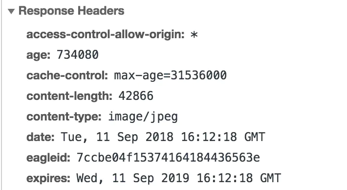
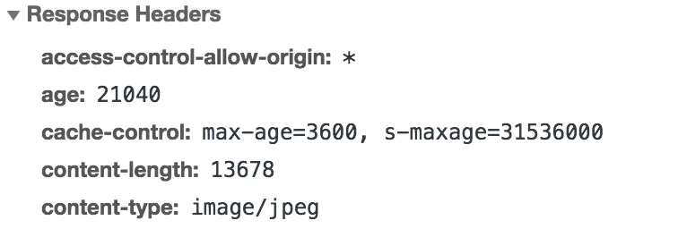

# 浏览器缓存机制

缓存可以减少网络 IO 消耗，提高访问速度。浏览器缓存是一种操作简单、效果显著的前端性能优化手段。

浏览器的缓存机制有四个方面，它们按照获取资源时请求的优先级排序如下：

1. Service Worker Cache

2. Memory Cache

3. Disk Cache

4. Push Cache(HTTP2 新特性)

## Server Worker Cache

- 独立于主 JavaScript 线程（这就意味着它的运行丝毫不会影响我们主进程的加载性能）

- 设计完全异步,大量使用 Promise（因为通常 Service Worker 通常会等待响应后继续，Promise 再合适不过了）

- 不能访问 DOM，不能使用 XHR 和 localStorage

- Service Worker 只能由 HTTPS 承载(出于安全考虑)

Service Worker 离线缓存的文件存储在浏览器的缓存存储（Cache Storage）中。每个浏览器有自己的方式来管理这些缓存文件，通常存储在用户的本地文件系统中。但是，具体的存储位置是由浏览器管理的，开发者无法直接访问这些文件。

### Service Worker 可以用于以下用途：

- 离线支持：缓存资源，使应用在没有网络连接时仍能工作。

- 网络请求拦截和处理：拦截网络请求，可以自定义请求响应，例如从缓存提供响应。

- 推送通知：与推送服务结合，实现 web 推送通知功能。

- 后台数据同步：在网络恢复时自动同步数据。

- 性能优化：通过缓存策略减少服务器请求，提升加载速度。

- Service Worker 运行在独立的线程中，不会阻塞主线程，从而提高应用的响应性。

### 使用 Service Worker

Service Worker 是一种独立于主线程之外的 Javascript 线程。它脱离于浏览器窗体，因此无法直接访问 DOM。这样独立的个性使得 Service Worker 的“个人行为”无法干扰页面的性能，这个“幕后工作者”可以帮我们实现离线缓存、消息推送和网络代理等功能。我们借助 Service worker 实现的离线缓存就称为 Service Worker Cache。

Service Worker 的生命周期包括 install、active、working 三个阶段。一旦 Service Worker 被 install，它将始终存在，只会在 active 与 working 之间切换，除非我们主动终止它。这是它可以用来实现离线存储的重要先决条件。

下面我们就通过实战的方式，一起见识一下 Service Worker 如何为我们实现离线缓存（注意看注释）： 我们首先在入口文件中插入这样一段 JS 代码，用以判断和引入 Service Worker：

```js
window.navigator.serviceWorker
  .register("/test.js")
  .then(function () {
    console.log("注册成功");
  })
  .catch((err) => {
    console.error("注册失败");
  });
```

在 test.js 中，我们进行缓存的处理。假设我们需要缓存的文件分别是 test.html,test.css 和 test.js：

```js
// Service Worker会监听 install事件，我们在其对应的回调里可以实现初始化的逻辑
self.addEventListener("install", (event) => {
  event.waitUntil(
    // 考虑到缓存也需要更新，open内传入的参数为缓存的版本号
    caches.open("test-v1").then((cache) => {
      return cache.addAll([
        // 此处传入指定的需缓存的文件名
        "/test.html",
        "/test.css",
        "/test.js",
      ]);
    })
  );
});

// Service Worker会监听所有的网络请求，网络请求的产生触发的是fetch事件，我们可以在其对应的监听函数中实现对请求的拦截，进而判断是否有对应到该请求的缓存，实现从Service Worker中取到缓存的目的
self.addEventListener("fetch", (event) => {
  event.respondWith(
    // 尝试匹配该请求对应的缓存值
    caches.match(event.request).then((res) => {
      // 如果匹配到了，调用Server Worker缓存
      if (res) {
        return res;
      }
      // 如果没匹配到，向服务端发起这个资源请求
      return fetch(event.request).then((response) => {
        if (!response || response.status !== 200) {
          return response;
        }
        // 请求成功的话，将请求缓存起来。
        caches.open("test-v1").then(function (cache) {
          cache.put(event.request, response);
        });
        return response.clone();
      });
    })
  );
});
```

试试吧:

https://blog.csdn.net/weixin_41796631/article/details/89314876

PS：大家注意 Server Worker 对协议是有要求的，必须以 https 协议为前提，本地调试的话用 localhost 和 127.0.0.1 的 ip 地址也是可以的。

## Memory Cache

MemoryCache，是指存在内存中的缓存。从优先级上来说，它是浏览器最先尝试去命中的一种缓存。从效率上来说，它是响应速度最快的一种缓存。

内存缓存是快的，也是“短命”的。它和渲染进程“生死相依”，当进程结束后，也就是 tab 关闭以后，内存里的数据也将不复存在。

那么哪些文件会被放入内存呢？

事实上，这个划分规则，一直以来是没有定论的。不过想想也可以理解，内存是有限的，很多时候需要先考虑即时呈现的内存余量，再根据具体的情况决定分配给内存和磁盘的资源量的比重——资源存放的位置具有一定的随机性。

虽然划分规则没有定论，但根据日常开发中观察的结果，包括我们开篇给大家展示的 Network 截图，我们至少可以总结出这样的规律：资源存不存内存，浏览器秉承的是“节约原则”。我们发现，Base64 格式的图片，几乎永远可以被塞进 memory cache，这可以视作浏览器为节省渲染开销的“自保行为”；此外，体积不大的 JS、CSS 文件，也有较大地被写入内存的几率——相比之下，较大的 JS、CSS 文件就没有这个待遇了，内存资源是有限的，它们往往被直接甩进磁盘。

## Disk Cache

Disk Cache 也就是存储在硬盘中的缓存，读取速度慢点，但是什么都能存储到磁盘中，比之 Memory Cache 胜在容量和存储时效性上。

在所有浏览器缓存中，Disk Cache 覆盖面基本是最大的。它会根据 HTTP Herder 中的字段判断哪些资源需要缓存，哪些资源可以不请求直接使用，哪些资源已经过期需要重新请求。并且即使在跨站点的情况下，相同地址的资源一旦被硬盘缓存下来，就不会再次去请求数据。

## Push Cache

[HTTP/2 push is tougher than I thought](https://jakearchibald.com/2017/h2-push-tougher-than-i-thought/)

Push Cache 是指 HTTP2 在 server push 阶段存在的缓存。这块的知识比较新，应用也还处于萌芽阶段，我找了好几个网站也没找到一个合适的案例来给大家做具体的介绍。但应用范围有限不代表不重要——HTTP2 是趋势、是未来。在它还未被推而广之的此时此刻，我仍希望大家能对 Push Cache 的关键特性有所了解：

- Push Cache 是缓存的最后一道防线。浏览器只有在 Memory Cache、HTTP Cache 和 Service - Worker Cache 均未命中的情况下才会去询问 Push Cache。
- Push Cache 是一种存在于会话阶段的缓存，当 session 终止时，缓存也随之释放。
- 不同的页面只要共享了同一个 HTTP2 连接，那么它们就可以共享同一个 Push Cache。

更多的特性和应用，期待大家可以在日后的开发过程中去挖掘和实践。

## HTTP 缓存机制

HTTP 缓存是我们日常开发中最为熟悉的一种缓存机制。它又分为强缓存和协商缓存。优先级较高的是强缓存，在命中强缓存失败的情况下，才会走协商缓存。

### 强缓存的特征

强缓存是利用 http 头中的 Expires 和 Cache-Control 两个字段来控制的。强缓存中，当请求再次发出时，浏览器会根据其中的 expires 和 cache-control 判断目标资源是否“命中”强缓存，若命中则直接从缓存中获取资源，不会再与服务端发生通信。

命中强缓存的情况下，返回的 HTTP 状态码为 200

### 强缓存的实现：从 expires 到 cache-control

实现强缓存，过去我们一直用 expires。
当服务器返回响应时，在 Response Headers 中将过期时间写入 expires 字段。像这样：



expires 字段：

```
expires: Wed, 11 Sep 2019 16:12:18 GMT
```

可以看到，expires 是一个时间戳，接下来如果我们试图再次向服务器请求资源，浏览器就会先对比本地时间和 expires 的时间戳，如果本地时间小于 expires 设定的过期时间，那么就直接去缓存中取这个资源。由于时间戳是服务器来定义的，而本地时间的取值却来自客户端，因此 expires 的工作机制对客户端时间与服务器时间之间的一致性提出了极高的要求，若服务器与客户端存在时差，将带来意料之外的结果。

expires 允许我们通过绝对的时间戳来控制缓存过期时间，相应地，Cache-Control 中的 max-age 字段也允许我们通过设定相对的时间长度来达到同样的目的。在 HTTP1.1 标准试图将缓存相关配置收敛进 Cache-Control 这样的大背景下， max-age 可以视作是对 expires 能力的补位/替换。在当下的前端实践里，我们普遍会倾向于使用 max-age。但如果你的应用对向下兼容有强诉求，那么 expires 仍然是不可缺少的。

cache-control 字段：

```
cache-control: max-age=31536000
```

如大家所见，在 Cache-Control 中，我们通过 max-age 来控制资源的有效期。max-age 不是一个时间戳，而是一个时间长度。在本例中，max-age 是 31536000 秒，它意味着该资源在 31536000 秒以内都是有效的。

注意，max-age 是一个相对时间，这就意味着它有能力规避掉 expires 可能会带来的时差问题：max-age 机制下，资源的过期判定不再受服务器时间戳的限制。客户端会记录请求到资源的时间点，以此作为相对时间的起点，从而确保参与计算的两个时间节点（起始时间和当前时间）都来源于客户端，由此便能够实现更加精准的判断。

Cache-Control 的 max-age 配置项相对于 expires 的优先级更高。当 Cache-Control 与 expires 同时出现时，我们以 Cache-Control 为准。

### Cache-Control 应用分析

#### s-maxage

在项目不是特别大的场景下，max-age 足够用了。但在依赖各种代理的大型架构中，我们不得不考虑代理服务器的缓存问题。s-maxage 就是用于表示 cache 服务器上（比如 cache CDN）的缓存的有效时间的，并只对 public 缓存有效。

```
cache-control: max-age=3600, s-maxage=31536000
```

s-maxage 仅在代理服务器中生效，客户端中我们只考虑 max-age

#### public 与 private

那么什么是 public 缓存呢？说到这里，Cache-Control 中有一些适合放在一起理解的知识点，我们集中梳理一下：

public 与 private 是针对资源是否能够被代理服务缓存而存在的一组对立概念。

如果我们为资源设置了 public，那么它既可以被浏览器缓存，也可以被代理服务器缓存；如果我们设置了 private，则该资源只能被浏览器缓存。private 为默认值。但多数情况下，public 并不需要我们手动设置，比如有很多线上网站的 cache-control 是这样的：



设置了 s-maxage，没设置 public，那么 CDN 还可以缓存这个资源吗？答案是肯定的。因为明确的缓存信息（例如“max-age”）已表示响应是可以缓存的。

#### no-store 与 no-cache

no-cache 绕开了浏览器：我们为资源设置了 no-cache 后，每一次发起请求都不会再去询问浏览器的缓存情况，而是直接向服务端去确认该资源是否过期（即走我们下文即将讲解的协商缓存的路线）。

no-store 比较绝情，顾名思义就是不使用任何缓存策略。在 no-cache 的基础上，它连服务端的缓存确认也绕开了，只允许你直接向服务端发送请求、并下载完整的响应。

### 协商缓存：浏览器与服务器合作之下的缓存策略

协商缓存依赖于服务端与浏览器之间的通信。

协商缓存机制下，浏览器需要向服务器去询问缓存的相关信息，进而判断是重新发起请求、下载完整的响应，还是从本地获取缓存的资源。

如果服务端提示缓存资源未改动（Not Modified），资源会被重定向到浏览器缓存，这种情况下网络请求对应的状态码是 304。

#### 协商缓存的实现：从 Last-Modified 到 ETag

Last-Modified 是一个时间戳，如果我们启用了协商缓存，它会在首次请求时随着 Response Headers 返回：

```
Last-Modified: Fri, 27 Oct 2017 06:35:57 GMT
```

随后我们每次请求时，会带上一个叫 If-Modified-Since 的时间戳字段，它的值正是上一次 response 返回给它的 last-modified 值：

```
If-Modified-Since: Fri, 27 Oct 2017 06:35:57 GMT
```

服务器接收到这个时间戳后，会比对该时间戳和资源在服务器上的最后修改时间是否一致，从而判断资源是否发生了变化。如果发生了变化，就会返回一个完整的响应内容，并在 Response Headers 中添加新的 Last-Modified 值；否则，返回如上图的 304 响应，Response Headers 不会再添加 Last-Modified 字段。

使用 Last-Modified 存在一些弊端，这其中最常见的就是这样两个场景：

- 我们编辑了文件，但文件的内容没有改变。服务端并不清楚我们是否真正改变了文件，它仍然通过最后编辑时间进行判断。因此这个资源在再次被请求时，会被当做新资源，进而引发一次完整的响应——不该重新请求的时候，也会重新请求。

- 当我们修改文件的速度过快时（比如花了 100ms 完成了改动），由于 If-Modified-Since 只能检查到以秒为最小计量单位的时间差，所以它是感知不到这个改动的——该重新请求的时候，反而没有重新请求了

这两个场景其实指向了同一个 bug——服务器并没有正确感知文件的变化。为了解决这样的问题，Etag 作为 Last-Modified 的补充出现了。

Etag 是由服务器为每个资源生成的唯一的标识字符串，这个标识字符串是基于文件内容编码的，只要文件内容不同，它们对应的 Etag 就是不同的，反之亦然。因此 Etag 能够精准地感知文件的变化。

Etag 和 Last-Modified 类似，当首次请求时，我们会在响应头里获取到一个最初的标识符字符串，举个例子，它可以是这样的：

```
ETag: W/"2a3b-1602480f459"
```

那么下一次请求时，请求头里就会带上一个值相同的、名为 if-None-Match 的字符串供服务端比对了：

```
If-None-Match: W/"2a3b-1602480f459"
```

Etag 的生成过程需要服务器额外付出开销，会影响服务端的性能，这是它的弊端。因此启用 Etag 需要我们审时度势。正如我们刚刚所提到的——Etag 并不能替代 Last-Modified，它只能作为 Last-Modified 的补充和强化存在。 Etag 在感知文件变化上比 Last-Modified 更加准确，优先级也更高。当 Etag 和 Last-Modified 同时存在时，以 Etag 为准。

开启缓存和协商缓存需要在 nginx 服务器上的响应头做一些配置：
可参考：https://www.jb51.net/article/176543.htm

- 默认启用强缓存 机制
- Cache-Control: no-cache 启用协商缓存
- Cache-Control：no-store 不启用缓存

#### ETag 如何生成？

nginx 中 ETag 由响应头的 Last-Modified 与 Content-Length 表示为十六进制组合而成。

算法：16 进制（Last-Modified ）-16 进制（Content-Length）

即 ETag 由

1. 文件的编号

2. 文件最后修改时间

3. 文件大小

这三个要素来生成。

response 数据

```
$ curl --head 10.97.109.49
HTTP/1.1 200 OK
Server: nginx/1.16.0
Date: Tue, 10 Dec 2019 06:45:24 GMT
Content-Type: text/html
Content-Length: 612
Last-Modified: Tue, 23 Apr 2019 10:18:21 GMT
Connection: keep-alive
ETag: "5cbee66d-264"
Accept-Ranges: bytes
```

js 反解

```
> new Date(parseInt('5cbee66d', 16) * 1000).toJSON()
"2019-04-23T10:18:21.000Z"
> parseInt('264', 16)
612
```

最好不要用摘要算法（hash），摘要算法 CPU 密集型运算，成本很高。

#### ETag 变了说明文件改变了吗？

不一定， Last-Modified 根据 mtime 生成，touch file 也会导致 mtime 变化，但是实际的文件不一定发生改变

#### ETag 不变文件有可能发生变化吗？

有可能。1s 内更改文件，并且保持文件大小不变。此时文件大小没有发生更改，ETag 不会改变。但这需要极其苛刻的条件且这种情况出现概率很低，因此忽略了

## HTTP 缓存决策指南

Chrome 官方给出的流程图：


- Cache-Control: no-store 拒绝一切形式的缓存
- Cache-Control: no-cache 每次都启用协商缓存
- Cache-Control: public、private 是否可以被代理服务器缓存
- Cache-Control: max-age、s-maxage 资源过期时间
- Expires: 绝对时间
- Last-Modified（If-Modified-Since） 和 ETag(If-None-Match) 配合协商缓存

### 浏览器是根据什么决定「from disk cache」与「from memory cache」？

第一个现象(以图片为例):访问-> 200 -> 退出浏览器再进来-> 200(from disk cache) -> 刷新 -> 200(from memory cache)总结: 会不会是 chrome 很聪明的判断既然已经从 disk 拿来了， 第二次就内存拿吧 快。

第二个现象(以图片为例):只要图片是 base64 我看都是 from memroy cache。

总结: 解析渲染图片这么费劲的事情，还是做一次然后放到内存吧。 用的时候直接拿

第三个现象(以 js css 为例):个人在做静态测试的发现，大型的 js css 文件都是直接 disk cache 总结: chrome 会不会说，我擦，你这么大太占地方了。你就去硬盘里呆着吧。慢就慢点吧。

第四个现象:隐私模式下，几乎都是 from memroy cache。总结: 隐私模式是吧，我不能暴露你东西，还是放到内存吧。你关，我死。
