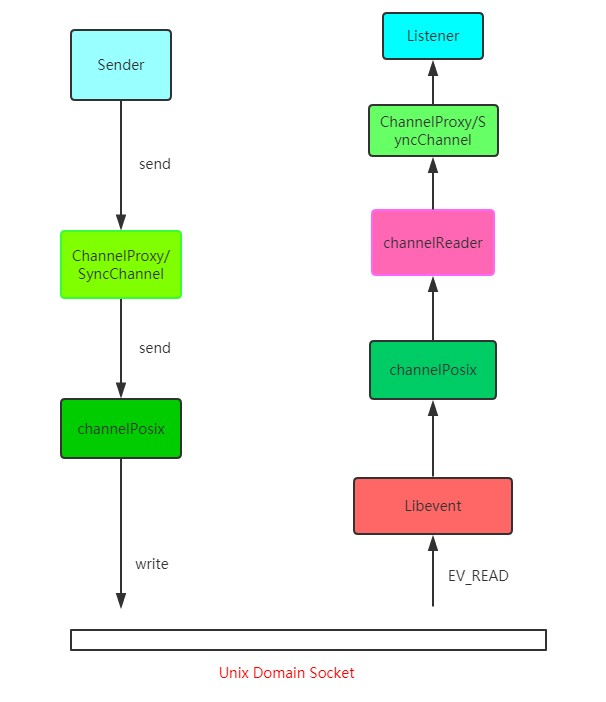

# CORS 跨域

## 什么是跨域

### 同源策略

浏览器遵循同源策略：scheme(协议)、host（主机）和 port（端口）都相同则为同源。

URI 组成：

scheme://host:port/path?query#fragment

### 非同源站点的限制

非同源的例子：

- 协议不同：http 和 https

- 主域名（主机）不同：www.baidu.com 和 www.test.com

- 端口号不同：www.test.com:8080 和 www.test.com:3000

非同源的限制：

- 不能读取和修改对方的 DOM
- 不能访问对方的 Cookie、IndexDB 和 LocalStorage
- 限制 XMLHTTPRequest 请求（重点）

### 跨域请求

当浏览器向目标 URI 发送 Ajax 请求的时候，只要当前的 URL 和目标 URL 不同源，则产生跨域，被称为跨域请求。

跨域请求的响应一般会被浏览器所拦截，但是响应其实成功到达了客户端。

首先要知道，浏览器是多进程的，以 Chrome 为例，进程组成如下：

- 渲染进程（sandbox）
- 插件进程
- 浏览器主进程
- GPU 进程

> WebKit 渲染引擎和 V8 引擎都在渲染进程当中。

当 xhr.send 被调用，即 Ajax 请求准备发送的时候，其实还只是在渲染进程进行处理，为了防止黑客通过脚本触碰到系统资源，浏览器将每一个渲染进程装进了沙箱，并且为了防止 CPU 芯片一直存在的 Spectre 和 Meltdown 漏洞，采用了站点隔离的手段，给每一个不同站点（一级域名不同）分配了沙箱，互不干扰。

在沙箱当中的渲染进程是没有办法发送网络请求的，那怎么办？只能通过网络进程来发送。那这样就涉及到进程间通信(IPC，Inter Process Communication)了。只能通过网络进程来发送。那这样就涉及到进程间通信(IPC，Inter Process Communication)了。接下来我们看看 chromium 当中进程间通信是如何完成的，在 chromium 源码中调用顺序如下:



可能看了你会比较懵，如果想深入了解可以去看看 chromium 最新的源代码，IPC 源码地址及 [Chromium IPC 源码解析](https://blog.csdn.net/Luoshengyang/article/details/47822689)文章。

总的来说就是利用 Unix Domain Socket 套接字，配合事件驱动的高性能网络并发库 libevent 完成进程的 IPC 过程。

好，现在数据传递给了浏览器主进程，主进程接收到后，才真正地发出相应的网络请求。

在服务端处理完数据后，将响应返回，主进程检查到跨域，且没有 cors(后面会详细说)响应头，将响应体全部丢掉，并不会发送给渲染进程。这就达到了拦截数据的目的。

接下来我们来说一说解决跨域问题的几种方案。

### 漏洞扩展阅读

- Spectre 漏洞：又称为幽灵漏洞，幽灵漏洞是一个存在于分支预测实现中的硬件缺陷及安全漏洞，含有预测执行功能的现代微处理器均受其影响，漏洞利用是基于时间的旁路攻击，允许恶意进程获得其他程序在映射内存中的数据内容。

- Meltdown 漏洞：又称为熔断漏洞， 假设指定的内核虚拟地址是 X，地址 X 存储的数据是 M，使用数据 M 又计算出另一个地址 Y，在计算访问地址 Y 处元素的时间，这就是 meltdown 获取内核数据的整体思路。假如 2000 是存储有要窃取数据的地址，而地址 2000 存储的数据范围是 0-4。规定地址 Y 的计算方式为，地址 2000 存储的数据加 5000，那么我们就得到了 5 个地址，5000，5001，5002，5003，5004 。然后计算访问这 5 个地址的内存的时间，如果访问地址 5003 的时间最短，则说明地址 5003 对应的数据在 cache 中，这样攻击者就得到内核虚拟地址 2000 存储的数据是 3。

- meltdown 漏洞攻击属于安全领域的侧信道攻击范畴，具体来说属于 cache 侧信道攻击，cache 侧信道包含几种攻击手段，Evict+Time，Prime+Probe，Flush+Reload。而在 meltdown 论文中采用的是 flush+reload 的方式，攻击者频繁的使用 clflush 指令 flush 一个目标地址，通过计算重新加载(reload)目标地址处数据的时间，攻击者就可以知道该地址处的数据是否在同一时间被加载的 cache 中。值得注意的是，一次 flush+reload 只针对一个 cacheline，flush+reload 攻击的目标是 L3cache。

## CORS

### 简介

CORS 其实是 W3C 的一个标准，全称是跨域资源共享。它允许浏览器向跨源服务器，发出 XMLHttpRequest 请求，从而克服了 AJAX 只能同源使用的限制。
它需要浏览器和服务器的共同支持，CORS 需要浏览器和服务器同时支持。目前，所有浏览器都支持该功能，IE 浏览器不能低于 IE10。服务器需要附加特定的响应头，后面具体拆解。不过在弄清楚 CORS 的原理之前，我们需要清楚两个概念: 简单请求和非简单请求。

### 简单请求

浏览器根据请求方法和请求头的特定字段，将请求做了一下分类，具体来说规则是这样，凡是满足下面条件的属于简单请求:

- 请求方法为 GET、POST 或者 HEAD
- 请求头的取值范围: Accept、Accept-Language、Content-Language、Content-Type(只限于三个值 application/x-www-form-urlencoded、multipart/form-data、text/plain)

凡是不同时满足上面两个条件，就属于非简单请求。浏览器对这两种请求的处理，是不一样的。

对于简单请求，浏览器直接发出 CORS 请求。具体来说，就是在头信息之中，增加一个 Origin 字段。

下面是一个例子，浏览器发现这次跨源 AJAX 请求是简单请求，就自动在头信息之中，添加一个 Origin 字段。

```
GET /cors HTTP/1.1
Origin: http://api.test.com
Host: api.alice.com
Accept-Language: en-US
Connection: keep-alive
User-Agent: Mozilla/5.0…
```

上面的头信息中，Origin 字段用来说明，本次请求来自哪个源（协议 + 域名 + 端口）。服务器根据这个值，决定是否同意这次请求。

如果 Origin 指定的源，不在许可范围内，服务器会返回一个正常的 HTTP 回应。浏览器发现，这个回应的头信息没有包含 Access-Control-Allow-Origin 字段（详见下文），就知道出错了，从而抛出一个错误，被 XMLHttpRequest 的 onerror 回调函数捕获。注意，这种错误无法通过状态码识别，因为 HTTP 回应的状态码有可能是 200。

如果 Origin 指定的域名在许可范围内，服务器返回的响应，会多出几个头信息字段。

```
Access-Control-Allow-Origin: http://api.test.com
Access-Control-Allow-Credentials: true
Access-Control-Expose-Headers: FooBar
Content-Type: text/html; charset=utf-8
```

上面的头信息之中，有三个与 CORS 请求相关的字段，都以 Access-Control-开头。

（1）Access-Control-Allow-Origin

该字段是必须的。它的值要么是请求时 Origin 字段的值，要么是一个\*，表示接受任意域名的请求。

（2）Access-Control-Allow-Credentials

该字段可选。它的值是一个布尔值，表示是否允许发送 Cookie。默认情况下，Cookie 不包括在 CORS 请求之中。设为 true，即表示服务器明确许可，Cookie 可以包含在请求中，一起发给服务器。这个值也只能设为 true，如果服务器不要浏览器发送 Cookie，删除该字段即可。

（3）Access-Control-Expose-Headers

该字段可选。CORS 请求时，XMLHttpRequest 对象的 getResponseHeader()方法只能拿到 6 个基本字段：Cache-Control、Content-Language、Content-Type、Expires、Last-Modified、Pragma。如果想拿到其他字段，就必须在 Access-Control-Expose-Headers 里面指定。上面的例子指定，getResponseHeader('FooBar')可以返回 FooBar 字段的值。

### withCredentials 属性

上面说到，CORS 请求默认不发送 Cookie 和 HTTP 认证信息。如果要把 Cookie 发到服务器，一方面要服务器同意，指定 Access-Control-Allow-Credentials 字段。

Access-Control-Allow-Credentials: true

另一方面，开发者必须在 AJAX 请求中打开 withCredentials 属性。

var xhr = new XMLHttpRequest();
xhr.withCredentials = true;

否则，即使服务器同意发送 Cookie，浏览器也不会发送。或者，服务器要求设置 Cookie，浏览器也不会处理。

但是，如果省略 withCredentials 设置，有的浏览器还是会一起发送 Cookie。这时，可以显式关闭 withCredentials。

xhr.withCredentials = false;

需要注意的是，如果要发送 Cookie，Access-Control-Allow-Origin 就不能设为星号，必须指定明确的、与请求网页一致的域名。同时，Cookie 依然遵循同源政策，只有用服务器域名设置的 Cookie 才会上传，其他域名的 Cookie 并不会上传，且（跨源）原网页代码中的 document.cookie 也无法读取服务器域名下的 Cookie。

### 复杂请求

非简单请求即复杂请求，是那种对服务器有特殊要求的请求，比如：

- 使用了复杂的请求方法（如 PUT，DELETE 等）。

- Content-Type 字段的类型是 application/json

- 请求头中使用了自定义的 HTTP 头字段。

- 请求中使用了 ReadableStream 流。

- 请求需要进行身份验证（需要提供客户端证书等）。

非简单请求的 CORS 请求，会在正式通信之前，增加一次 HTTP 查询请求，称为"预检"请求（preflight）。

浏览器先询问服务器，当前网页所在的域名是否在服务器的许可名单之中，以及可以使用哪些 HTTP 动词和头信息字段。只有得到肯定答复，浏览器才会发出正式的 XMLHttpRequest 请求，否则就报错。

我们以 PUT 方法为例。

```js
var url = "http://xxx.com";
var xhr = new XMLHttpRequest();
xhr.open("PUT", url, true);
xhr.setRequestHeader("X-Custom-Header", "xxx");
xhr.send();
```

当这段代码执行后，首先会发送预检请求。这个预检请求的请求行和请求体是下面这个格式:

```
OPTIONS / HTTP/1.1
Origin: 当前地址
Host: xxx.com
Access-Control-Request-Method: PUT
Access-Control-Request-Headers: X-Custom-Header
```

预检请求的方法是 OPTIONS，同时会加上 Origin 源地址和 Host 目标地址，这很简单。同时也会加上两个关键的字段:

- Access-Control-Request-Method, 列出 CORS 请求用到哪个 HTTP 方法
- Access-Control-Request-Headers，指定 CORS 请求将要加上什么请求头

这是预检请求。接下来是响应字段，响应字段也分为两部分，一部分是对于预检请求的响应，一部分是对于 CORS 请求的响应。

预检请求的响应。如下面的格式:

```
HTTP/1.1 200 OK
Access-Control-Allow-Origin: *
Access-Control-Allow-Methods: GET, POST, PUT
Access-Control-Allow-Headers: X-Custom-Header
Access-Control-Allow-Credentials: true
Access-Control-Max-Age: 1728000
Content-Type: text/html; charset=utf-8
Content-Encoding: gzip
Content-Length: 0
```

其中有这样几个关键的响应头字段:

- Access-Control-Allow-Origin: 表示可以允许请求的源，可以填具体的源名，也可以填\*表示允许任意源请求。
- Access-Control-Allow-Methods: 表示允许的请求方法列表。
- Access-Control-Allow-Credentials: 简单请求中已经介绍。
- Access-Control-Allow-Headers: 表示允许发送的请求头字段
- Access-Control-Max-Age: 预检请求的有效期，在此期间，不用发出另外一条预检请求。

在预检请求的响应返回后，如果请求不满足响应头的条件，则触发 XMLHttpRequest 的 onerror 方法，当然后面真正的 CORS 请求也不会发出去了。

一旦服务器通过了"预检"请求，以后每次浏览器正常的 CORS 请求，就都跟简单请求一样，会有一个 Origin 头信息字段。服务器的回应，也都会有一个 Access-Control-Allow-Origin 头信息字段。

#### 实际工作中遇到一个问题，现象是 get 请求不跨域，post 请求的预检请求出现了跨域，为什么？

- 之所以出现跨域，是因为预检请求会携带一些自定义的头部信息，例如 Access-Control-Request-Method、Access-Control-Request-Headers，而服务器未设置 access-control-allow-headers。当服务器设置了 access-control-allow-headers 就可以解决该问题

- 得思考的是，开发时并没有设置自定义 Headers 以及其它配置，为什么 post 请求成了复杂请求？ 因为在请求时，数据格式是 JSON 格式，这样浏览器会根据数据类型给 Content-Type 一个默认值 application/json，而 application/json 会导致请求变成复杂请求。

## JSONP

虽然 XMLHttpRequest 对象遵循同源政策，但是 script 标签不一样，它可以通过 src 填上目标地址从而发出 GET 请求，实现跨域请求并拿到响应。这也就是 JSONP 的原理。

### 封装一个 JSONP

```js
const jsonp = ({ url, params, callbackName }) => {
  const generateURL = () => {
    let dataStr = "";
    for (let key in params) {
      dataStr += `${key}=${params[key]}&`;
    }
    dataStr += `callback=${callbackName}`;
    return `${url}?${dataStr}`;
  };

  return new Promise((resolve, reject) => {
    // 初始化回调函数名称
    callbackName = callbackName || Math.random().toString().replace(".", "");

    // 创建 script 元素并加入到当前文档中
    let scriptEle = document.createElement("script");

    scriptEle.src = generateURL();

    document.body.appendChild(scriptEle);

    // 绑定到 window 上，为了后续调用

    window[callbackName] = (data) => {
      resolve(data);
      delete window.callbackName;
      document.body.removeChild(scriptEle);
    };
  });
};
```

调用

```js
jsonp({
  url: "http://localhost:3000",
  params: {
    num: 1,
  },
}).then((data) => {
  // 拿到数据进行处理
  console.log(data); // 数据包
});
```

### 封装思路贴合 JSONP 原理

同源策略只限制 Ajax 请求， 不限制 script 标签加载 js。 可以通过 script 标签请求资源， 并提前写好接收函数。

服务器收到请求后， 从 callback 参数得到 callbackName， 把原始数据（假设是 {a:1}） 处理后变成 `window[callbackName]({a:1})`

script 里的资源加载后会当成 js 执行， 相当于执行 `window[callbackName]({a:1})`， 即可在预定义的 `window[callbackName]` 函数里处理数据

和 CORS 相比，JSONP 最大的优势在于兼容性好，IE 低版本不能使用 CORS 但可以使用 JSONP，缺点也很明显，请求方法单一，只支持 GET 请求。

## Nginx

Nginx 是一种高性能的代理服务器，可以用来轻松解决跨域问题。


### 正向代理

正向代理帮助客户端访问客户端自己访问不到的服务器，然后将结果返回给客户端。

### 反向代理

反向代理拿到客户端的请求，将请求转发给其他的服务器，主要的场景是维持服务器集群的负载均衡，换句话说，反向代理帮其它的服务器拿到请求，然后选择一个合适的服务器，将请求转交给它。

### 解决跨域

因此，两者的区别就很明显了，正向代理服务器是帮客户端做事情，而反向代理服务器是帮其它的服务器做事情。

好了，那 Nginx 是如何来解决跨域的呢？

比如说现在客户端的域名为 client.com，服务器的域名为 server.com，客户端向服务器发送 Ajax 请求，当然会跨域了，那这个时候让 Nginx 登场了，通过下面这个配置:

```
server {
  listen  80;
  server_name  client.com;
  location /api {
    proxy_pass server.com;
  }
}
```

Nginx 相当于起了一个跳板机，这个跳板机的域名也是 client.com，让客户端首先访问 client.com/api，这当然没有跨域，然后 Nginx 服务器作为反向代理，将请求转发给 server.com，当响应返回时又将响应给到客户端，这就完成整个跨域请求的过程。

## http-proxy

在 vue 项目中使用 http-proxy 中间件就属于正向代理解决跨域的一种方法。在 vue 项目进行开发环境运行的时候，vue.config.js 的 proxy 选项就用了这个插件，常见配置如下：

```js
proxy: {
  "/api": {
    target: 'www.test.com',
    changeOrigin: true,
    // 是否进行路径重写
    pathRewrite: {
      "/api":""
    }
  }
}
```

- target: 拼接目标地址
- changeOrigin: 是否修改请求中的 origin 信息，达到虚拟 origin 的效果。

当你请求 /api/list 的时候，最终请求的地址就会变成 www.test.com/api/list, http-proxy 服务帮你完成了代理请求，而运行项目的时候，你本地的地址是 localhost, 发起请求的路径是 localhost/api/list，并不存在跨域的问题。实际上这就完成了跨域请求。

## 其他跨域方法

其实还有一些不太常用的方式，大家了解即可，比如 postMessage，当然 WebSocket 也是一种方式，还有另外一些奇技淫巧就不建议大家去死记硬背了，一方面从来不用，名字都难得记住，另一方面临时背下来，面试官也不会对你印象加分，因为看得出来是背的。当然没有背并不代表减分，把跨域原理和前面三种主要的跨域方式理解清楚，经得起更深一步的推敲，反而会让别人觉得你是一个靠谱的人。

## 参考

[理解 CPU Spectre 漏洞](https://www.freebuf.com/column/161135.html)

[Youtube 视频](https://www.youtube.com/watch?v=dBuykrdhK-A)

[什么是跨域](http://47.98.159.95/my_blog/blogs/net/http/014.html#%E4%BB%80%E4%B9%88%E6%98%AF%E8%B7%A8%E5%9F%9F)

[简单请求和非简单请求](https://blog.csdn.net/yexudengzhidao/article/details/100104134)
