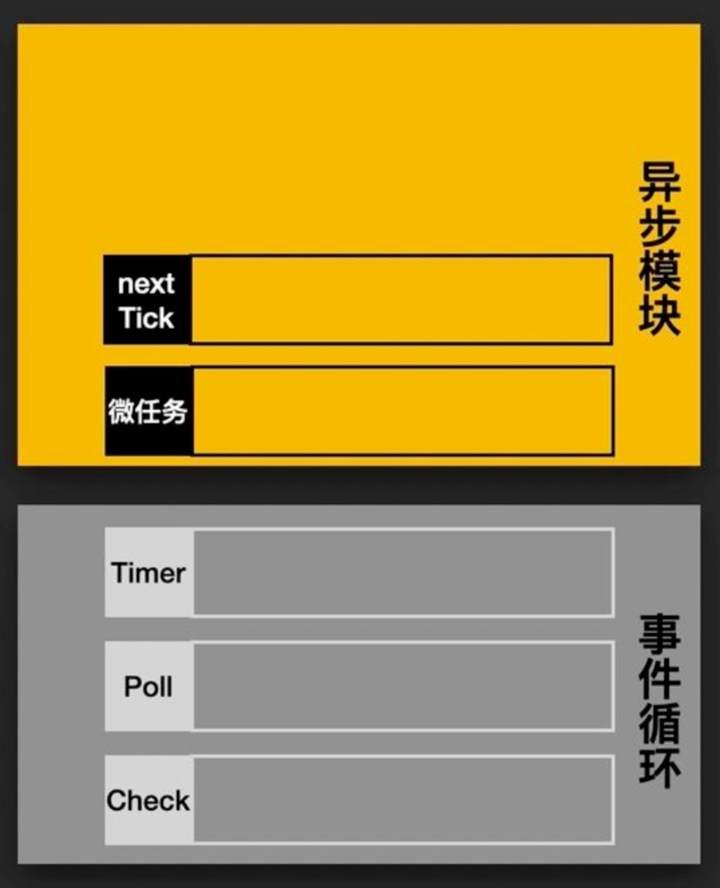
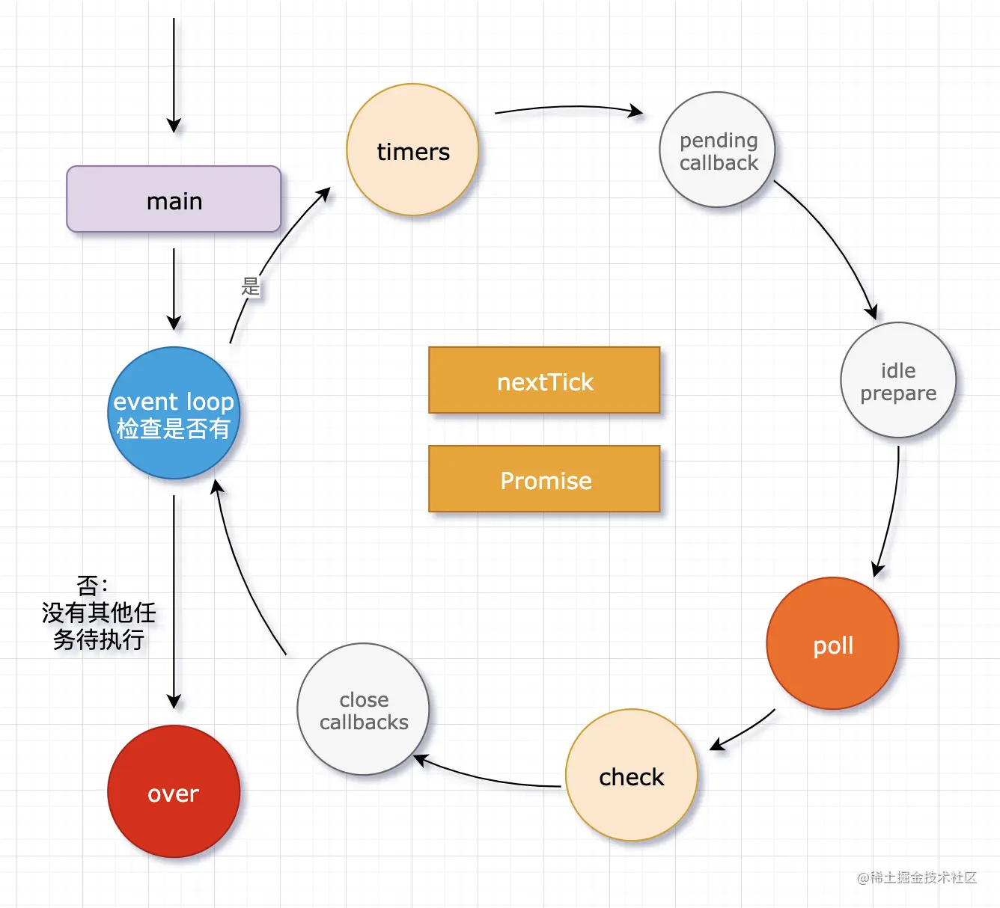

# 浏览器事件循环 Eventloop

## 宏任务

在 JS 中，大部分的任务都是在主线程上执行，常见的任务有:

- 1. 用户交互事件
- 2. 渲染事件
- 3. JS 脚本执行
- 4. 网络请求、文件读写等

为了让这些事件有条不紊地进行，JS 引擎需要对之执行的顺序做一定的安排。V8 引擎使用队列的方式来存储这些任务，按先进先出的方式来执行这些任务，模拟的代码如下：

```js
let keep_running = true;

function MainTherad() {
  while (true) {
    //执行队列中的任务
    const task = task_queue.takeTask();

    ProcessTask(task);

    //执行延迟队列中的任务
    ProcessDelayTask();

    if (!keep_running)
      //如果设置了退出标志，那么直接退出线程循环
      break;
  }
}
```

这里用到了一个 for 循环，将队列中的任务一一取出，然后执行，这个很好理解。但是其中包含了两种任务队列，除了上述提到的任务队列， 还有一个延迟队列，它专门处理诸如 setTimeout/setInterval 这样的定时器回调任务。

上述提到的，普通任务队列和延迟队列中的任务，都属于宏任务。

具体来说，宏任务包含了这些任务：setTimeout, setInterval, setImmediate, I/O, UI 渲染，JS 脚本

## 微任务

对于每个宏任务而言，其内部都有一个微任务队列。那为什么要引入微任务？微任务在什么时候执行呢？

其实引入微任务的初衷是为了解决异步回调的问题。想一想，对于异步回调的处理，有多少种方式？总结起来有两点:

- 1. 将异步回调进行宏任务队列的入队操作。
- 2. 将异步回调放到当前宏任务的末尾。

如果采用第一种方式，那么执行回调的时机应该是在前面所有的宏任务完成之后，倘若现在的任务队列非常长，那么回调迟迟得不到执行，造成应用卡顿。

为了规避这样的问题，V8 引入了第二种方式，这就是微任务的解决方式。在每一个宏任务中定义一个微任务队列，当该宏任务执行完成，会检查其中的微任务队列，如果为空则直接执行下一个宏任务，如果不为空，则依次执行微任务，执行完成才去执行下一个宏任务。

常见的微任务有 MutationObserver、Promise.then(或.reject) 以及以 Promise 为基础开发的其他技术(比如 fetch API), 还包括 V8 的垃圾回收过程。

Ok, 这便是宏任务和微任务的概念，接下来正式介绍 JS 非常重要的运行机制——EventLoop。

## 浏览器 EventLoop

### 从一个经典的例子开始说起

```js
console.log("start");
setTimeout(() => {
  console.log("timeout");
});
Promise.resolve().then(() => {
  console.log("resolve");
});
console.log("end");
```

上述代码执行后打印的顺序是：

start、end、resolve、timeout

### 分析

1. 刚开始整个脚本作为一个宏任务来执行，对于同步代码直接压入执行栈进行执行，因此先打印 start 和 end

2. setTimeout 作为一个宏任务放入宏任务队列

3. Promise.resolve() 返回一个 resolve 状态的 Promise 对象，then 中函数参数就是它的回调方法，所以把它加入微任务队列

4. 当本次宏任务执行完，检查当前微任务队列，发现一个 Promise.then, 执行打印 resolve

5. 接下来进入到下一个宏任务——setTimeout, 执行打印 timeout

### 总结

1. 一开始整段脚本作为第一个宏任务执行

2. 执行过程中同步代码直接执行，宏任务进入宏任务队列，微任务进入微任务队列

3. 当前宏任务执行完出队，检查微任务队列，如果有则依次执行，直到微任务队列为空

4. 执行浏览器 UI 线程的渲染工作

5. 检查是否有 Web worker 任务，有则执行

6. 执行队首新的宏任务，回到 2，依此循环，直到宏任务和微任务队列都为空

### 习题 1

```js
console.log("script start");

setTimeout(function () {
  console.log("setTimeout");
}, 0);

Promise.resolve()
  .then(function () {
    console.log("promise1");
  })
  .then(function () {
    console.log("promise2");
  });

console.log("script end");
```

- script start
- script end
- promise1
- promise2
- setTimeout

这道题需要一些 promise 相关的知识，.then 方法相当于一个回调，此题 promise 执行完相当于有两个回调，当前宏任务执行完需要清空微任务队列的，所以会把两个回调的微任务都执行完才会执行下一个宏任务。

### 习题 2

```js
Promise.resolve().then(() => {
  console.log("Promise1");
  setTimeout(() => {
    console.log("setTimeout2");
  }, 0);
});
setTimeout(() => {
  console.log("setTimeout1");
  Promise.resolve().then(() => {
    console.log("Promise2");
  });
}, 0);
console.log("start");
```

- start
- Promise1
- setTimeout1
- Promise2
- setTimeout2

这道题一定要细心，根据宏任务微任务的执行原则，一步一步分析，就能得到正确答案。

### 习题 3

```js
setTimeout(() => {
  console.log("1");
});
new Promise(function (resolve) {
  console.log("2");
  resolve();
}).then(function () {
  console.log("3");
});
console.log("4");
```

打印的结果是 2，4，3，1
Promise 传入的函数内部的同步代码是立即执行的！then 中的函数才是回调哈。

### 习题 4

```js
async function a1() {
  console.log("async1 start");
  await a2();
  console.log("async1 end");
}
async function a2() {
  console.log("async2");
}

console.log("script start");
setTimeout(function () {
  console.log("setTimeout");
}, 0);
a1();

new Promise((resolve) => {
  console.log("Promise1");
  resolve();
}).then(() => {
  console.log("Promise2");
});
```

- script start
- async1 start
- async2
- Promise1
- Promise2
- async1 end
- setTimeout

关键点在于 async1 end 为什么比 Promise2 后输出，要解释这个原因，需要将题目中的 async 和 await 转换成 promise 的写法后来判断。转换后的代码如下：

```js
function async1() {
  console.log("async1 start");
  const p = async2();
  return new Promise((resolve) => {
    Promise.resolve().then(() => {
      p.then(resolve);
    });
  }).then(() => {
    console.log("async1 end");
  });
}

function async2() {
  console.log("async2");
  return Promise.resolve();
}

console.log("script start");

setTimeout(function () {
  console.log("setTimeout");
}, 0);

async1();

new Promise((resolve) => {
  console.log("Promise1");
  resolve();
}).then(() => {
  console.log("Promise2");
});
```

这样看就清楚了些, 当 async2() 执行完了之后，真正的 asnyc1 end 相当于在一个微任务中又包装了一个微任务。

即打印 async2 之后，将 async1 end Promise 加入到微任务队列中，然后执行外层 Promise，打印结果 Promise1，把 Promise2 加入到微任务队列中，此时微任务队列是：

[async1 end Promise,Promise2],

此时执行 async1 end Promise，但是 async1 end 第一次执行，又执行一次回调，把真正的打印 async1 end 的任务，加入到新的微任务队列，此时微任务队列是：

[Promise2，async1 end]

然后依次打印 Promise2，async1 end。

### 习题 6

```js
var promise = new Promise((resolve) => {
  console.log(1);
  resolve();
});

setTimeout(() => {
  console.log(2);
});

promise.then(() => {
  requestAnimationFrame(() => {
    console.log(3);
    requestAnimationFrame(() => {
      console.log(4);
    });
  });
  console.log(5);
});

var promise2 = getPromise();

async function getPromise() {
  console.log(6);

  await promise;

  console.log(7);
}
console.log(8);
```

打印的结果是 1,6,8,5,7,2,3,4

- requestAnimationFrame 是宏任务

## NodeJS EventLoop

node 事件循环六个大阶段，核心关注 timers、poll、check 三个阶段即可

### Node 的异步 API 分类：

- 定时器 API： setTimeout、setInterval

- I/O 操作：文件读写、数据库操作、网络请求

- node 独有：process.nextTick、setImmediate

### 事件循环队列

针对上述三类事件， node 中初始化了三类队列

1. Timer 队列：用于处理 setTimeout 和 setInterval 定时器的回调

2. Poll 队列：用于处理 I/O 操作的回调（文件读写、数据库操作、网络请求）

事件循环会在空闲的情况下，在这里暂停，以等待新的 I/O 事件

3. Check 队列：用于处理 setImmediate 的回调

### process.nextTick

process.nextTick 有个单独的 nextTick，优先级 nextTick 最高，清空 nextTick 队列后再进入事件循环

Timer + Poll + Check 事件循环称为一个 Tick。

nextTick 总会在下一个 Tick 运行之前就执行。

### 如何处理微任务队列

微任务队列在 nextTick 队列之后，先清空 nextTick 和微任务队列，再进入事件循环

异步模块

    - nextTick
    - 微任务

事件循环

    - Timer
    - Poll
    - check



同浏览器一样，每执行一个事件循环（宏任务），就会清空一下异步模块（nextTick 和 微任务队列）

### setImmediate vs setTimeout

setImmediate 和 setTimeout 相似，但是根据调用时间的不同，它们的行为也不同。

- setImmediate 设计为在当前轮询 poll 阶段完成后执行脚本。

- setTimeout 计划在以毫秒为单位的最小阈值过去之后运行脚本。

### 总结

，六大阶段

梳理一下，nodejs 的 eventLoop 分为下面的几个阶段:

```js
   ┌───────────────────────────┐
┌─>│           timers          │
│  └─────────────┬─────────────┘
│  ┌─────────────┴─────────────┐
│  │     pending callbacks     │
│  └─────────────┬─────────────┘
│  ┌─────────────┴─────────────┐
│  │       idle, prepare       │
│  └─────────────┬─────────────┘      ┌───────────────┐
│  ┌─────────────┴─────────────┐      │   incoming:   │
│  │           poll            │<─────┤  connections, │
│  └─────────────┬─────────────┘      │   data, etc.  │
│  ┌─────────────┴─────────────┐      └───────────────┘
│  │           check           │
│  └─────────────┬─────────────┘
│  ┌─────────────┴─────────────┐
└──┤      close callbacks      │
   └───────────────────────────┘
```

1.  **timers 阶段：执行 setTimeout 和 setInterval 定时器相关回调函数**

2.  **Pending callbacks: 执行与操作系统相关的回调函数，比如启动服务端应用时监听端口操作的回调函数就在这里调用**

3.  **idle， prepare: 系统内部使用忽略**

4.  I/O poll 阶段：检索新的 I/O 事件，执行与 I/O 相关的回调（几乎所有的回调，除了关闭回调、计时器回调），节点将在适当的时候阻塞

- 如果轮询队列中有回调函数不为空，事件循环将遍历其回调队列并同步执行它们

- 如果轮询队列为空，则会发生如下两件事件：
  - 如果存在 setImmediate ，则当前阶段结束，执行 check 阶段的函数
  - 如果不存在 setImmediate，则等待当前 I/O 回调被添加到队列中，然后立即执行

5.  **check: 检查，setImmediate() 回调函数 I/O 和定时器之后尽快执行**

6.  **close callbacks: 关闭回调阶段 socket.on('close')**

## 参考

[习题](https://www.jianshu.com/p/2d896f96c179)

[NodeJS 事件循环](https://nodejs.org/zh-cn/docs/guides/event-loop-timers-and-nexttick/)
