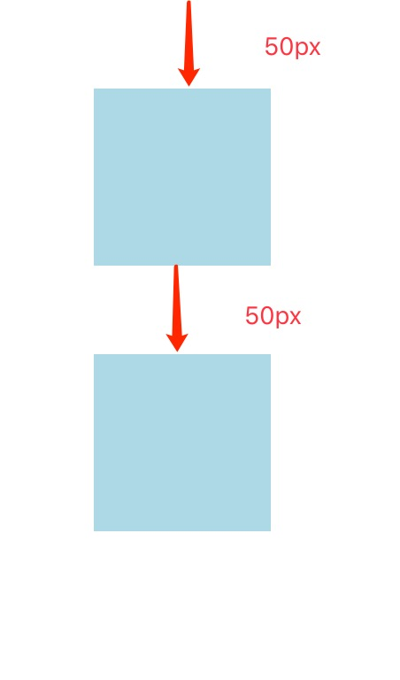
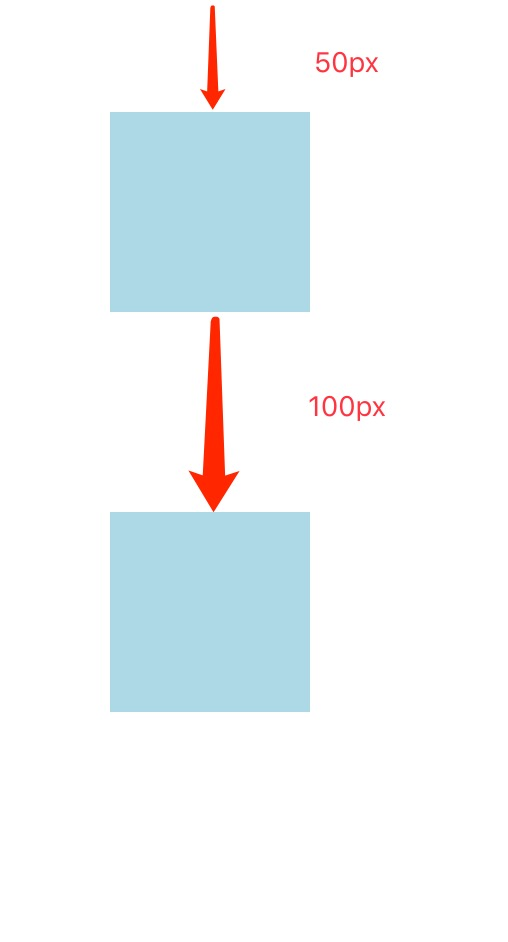
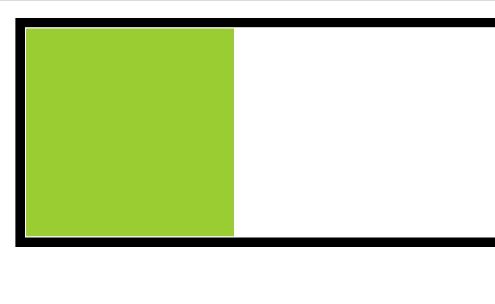
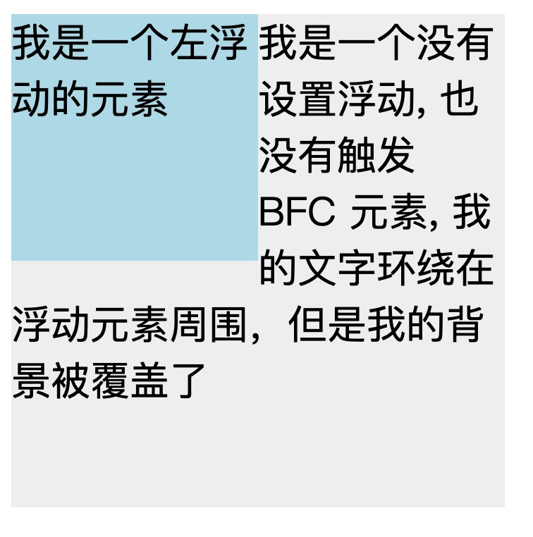
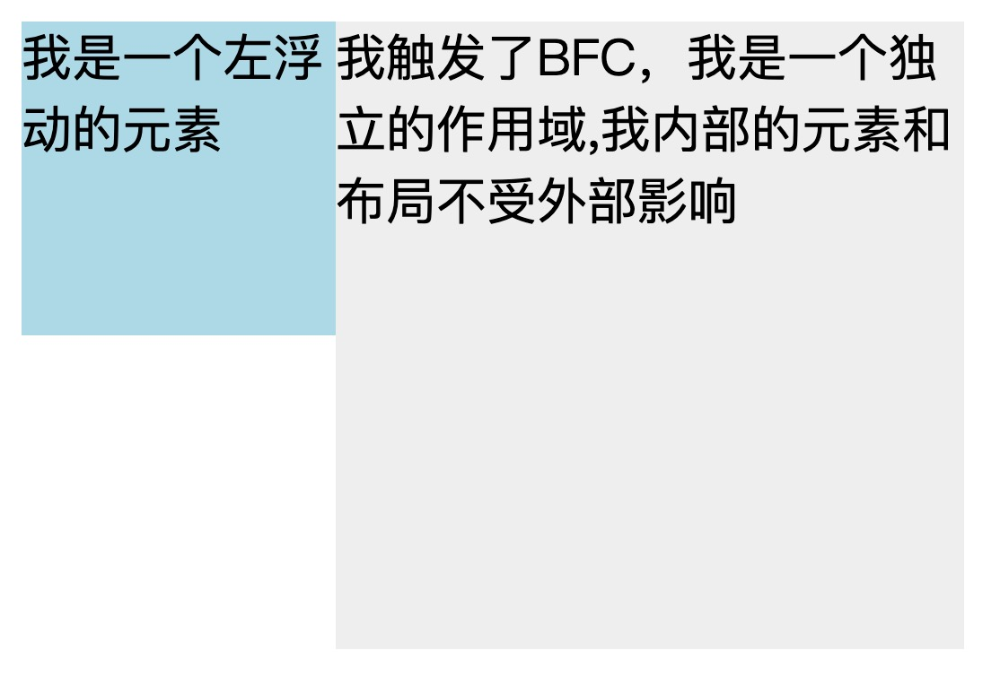

# BFC

## 1.什么是 BFC?

BFC (Block formatting context) 直译为"块级格式化上下文"，它是一个独立的渲染区域，具有 BFC 特性的元素可以看作是隔离了的独立容器，容器里面的元素不会在布局上影响到外面的元素，并且 BFC 具有普通容器所没有的一些特性。

通俗一点来讲，可以把 BFC 理解为一个封闭的大箱子，箱子内部的元素无论如何翻江倒海，都不会影响到外部。

## 2.如何创建 BFC(触发 BFC):

- body 根元素
- 浮动元素：float 除 none 以外的值
- 绝对定位元素：position (absolute、fixed)
- display 为 inline-block、table-cells、flex
- overflow 除了 visible 以外的值 (hidden、auto、scroll)

### 理解 overflow 能触发 BFC 的原因

- overflow: hidden 相当于把容器内部超出容器范围的内容进行修剪，相当于把内部的元素对外的影响限制在容器内
- overflow: scroll 创建了滚动条，内部元素都通过容器的滚动条进行控制
- overflow: auto 如果内容被修剪，则浏览器会显示滚动条以便查看其余的内容
- overflow: 默认值。内容不会被修剪，会呈现在元素框之外。所以它不会创建 BFC

### 理解绝对定位元素能触发 BFC 的原因

- position (absolute、fixed) 会让元素整体都脱离原先的文档流，为了不造成该元素对其它兄弟元素的影响，容器也会创建 BFC 防止其内部元素对外造成影响

### 理解浮动元素能触发 BFC 的原因

- float (left, right) 在浮动布局中，元素首先按照普通流的位置出现，然后根据浮动的方向尽可能的向左边或右边偏移，其效果与印刷排版中的文本环绕相似，为防止内部元素对外的影响，浮动元素也会创建 BFC

### 理解部分 display 布局能触发 BFC 的原因

- 如上所述，display 为 inline-block、table-cells、flex，都有其特殊作用和含义，其目的都是为了形成独自的作用域，独立的渲染空间，防止其内部元素对外的影响。

## 3.BFC 的作用

BFC 的三个作用：

- 防止外边距重叠 （同一个 BFC 下元素外边距会发生重叠，让两个元素不要处于同一个 BFC）
- 清除浮动影响 （让包含浮动元素的 div 创建 BFC，让浮动元素参与计算宽高）
- 防止文字环绕

### 3.1 防止外边距重叠

案例一：同属一个 BFC 的两个 div 元素外边距发生重叠，代码如下

```html
<head>
  <style>
    div {
      width: 100px;
      height: 100px;
      background: lightblue;
      margin: 50px;
    }
  </style>
</head>
<body>
  <div></div>
  <div></div>
</body>
```



如上图(p1-1)所示，body 本身是一个 bfc 容器，所以 body 元素内的第一个 div 的下边距和第二个 div 的上边距发生重叠。首先这不是 CSS 的 bug，我们可以理解为一种规范，如果想要避免外边距的重叠，可以将其放在不同的 BFC 容器中。

修改代码如下：

```html
<head>
  <style>
    .innerBox {
      width: 100px;
      height: 100px;
      background: lightblue;
      margin: 50px;
    }
    .container {
      overflow: hidden;
    }
  </style>
</head>
<body>
  <div class="container">
    <div class="innerBox"></div>
  </div>

  <div class="container">
    <div class="innerBox"></div>
  </div>
</body>
```

我们给两个 div 创建了各自的 BFC 容器，当两个容器不再同属同一个 BFC 的时候，它们的外边距也不再重叠。



### 3.2 清除浮动影响

浮动的元素会脱离普通的文档流，导致原来的容器无法包含浮动元素，导致容器只剩下两个边框的高度。

```html
<div style="border: 5px solid #000;">
  <div
    style="width: 100px;height: 100px;background: yellowgreen;float: left;"
  ></div>
</div>
```


给容器创建 BFC ，容器将会包含浮动元素，以此来清除浮动。



### 3.3 防止文字环绕（阻止被浮动元素覆盖）

```html
<div style="height: 100px;width: 100px;float: left;background: lightblue">
  我是一个左浮动的元素
</div>
<div style="width: 200px; height: 200px;background: #eee">
  我是一个没有设置浮动, 也没有触发 BFC 元素,
  我的文字环绕在浮动元素周围，但是我的背景被覆盖了
</div>
```


内容被浮动元素覆盖，但是文字在浮动元素周围环绕。
给第二个 div 创建 BFC
即加入 overflow: hidden 属性后，效果如下:

```html
<div style="height: 100px;width: 100px;float: left;background: lightblue">
  我是一个左浮动的元素
</div>
<div style="width: 200px; height: 200px;background: #eee; overflow: hidden;">
  我触发了BFC，我是一个独立的作用域,我内部的元素和布局不受外部影响
</div>
```



## 常见面试题

### 怎么触发 BFC，BFC 有什么应用场景？

文档流分为 定位流、浮动流、普通流 三种。

定位流：postion：absolute, fixed

浮动流：float

普通流：元素按先后顺序从上到下布局

触发方式（能够形成独立的渲染区域）：

- 浮动元素

- overflow 值不为 visible

- display 值为 inline-block、inline-table、inline-grid

- 绝对定位元素：postion：absolute, fixed

BFC 特性：

- 具有 BFC 特性的元素可以看作是隔离了的独立容器，容器内的元素不会影响到容器外面的元素。

- BFC 内部的块级盒子会在垂直方向上一个一个排列

- 浮动盒的区域不会和 BFC 重叠

- 计算 BFC 高度时，浮动元素也会参与计算

BFC 应用：

- 防止外边距重叠

- 解决浮动元素高度塌陷的问题

- 计算 BFC 高度时，浮动元素也会参与计算

## 参考文章

[10 分钟理解 BFC 原理](https://zhuanlan.zhihu.com/p/25321647)
