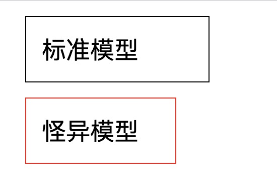
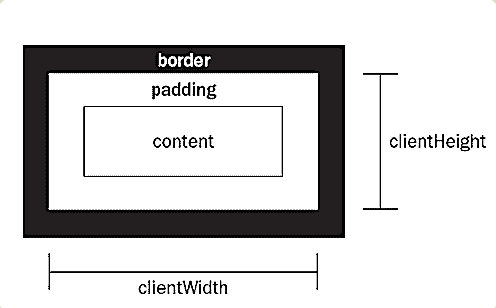
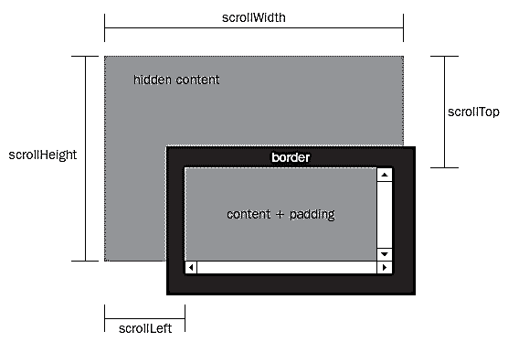
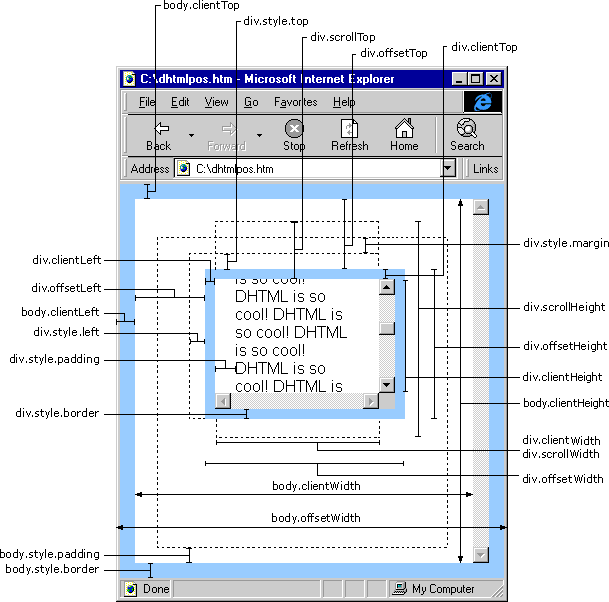

# 盒子模型
所有HTML元素可以看作盒子，在CSS中，"box model"这一术语是用来设计和布局时使用。
> CSS盒模型本质上是一个盒子，封装周围的HTML元素，它包括：外边距（margin）、边框（border）、内边距（padding）、实际内容（content）四个属性。
盒模型允许我们在其它元素和周围元素边框之间的空间放置元素。


## 标准盒模型和怪异盒模型

CSS 盒子模型分为两类：W3C盒子模型(标准盒模型)和IE盒子模型(怪异盒模型)
他们都包括：content(内容区域）、padding区域、border区域、margin区域

他俩的不同之处在于对宽高的定义不同。

- W3C盒子模型的 width = content.width
- W3C盒子模型的 height = content.height

- IE盒子模型的 width = content.width + padding * 2 + border * 2
- IE盒子模型的 height = content.height + padding * 2 + border * 2 

### 定义盒子模型

可以通过定义 box-sizing 的值，来定义某个区域元素的盒子模型。

W3C盒子模型 box-sizing: content-box;
IE盒子模型 box-sizing: border-box;

### 实例
下面通过一个实例来了解他们之间的差异：

定义如下代码
```html
<head>
    <style>
        .content-box {
            box-sizing: content-box;
            margin: 10px;
            padding: 10px;
            border: 1px solid black;
            width: 100px;
        }
        .border-box {
            box-sizing: border-box;
            margin: 10px;
            padding: 10px;
            border: 1px solid red;
            width: 100px;
        }
    </style>
</head>
<body>
    <!-- width = content -->
    <div class="content-box" id="c1">
        标准模型
    </div>


    <!-- width = border + padding + content -->
    <div class="border-box" id="c2">
        怪异模型
    </div>
</body>
```
效果如下：



### 计算总宽度

明明定义了同样的 width、pading、margin 和 border 他们最后展现的结果却不同。
现在来计算一下他们各自真实的 content 宽度和总宽度到底为多少（这里暂时不考虑margin)

- W3C 标准模型，content 宽度就是定义的宽度 width = 100px
- 视觉总宽度 = width + padding * 2 + border * 2 = 100px + 20px + 2px = 122px
- IE 怪异模型，content 宽度 = width - padding2 - border2 = 100px -20px -2px = 77px
- 视觉总宽度 = width(content + padding2 + border 2) = 100px

由于模型的不同，这里的视觉总宽度就差了 22px。

## 如何获取元素 CSS 属性
```javascript
let c1 = document.getElementById('c1')
// 只能获取元素的行内样式的属性值，如果没写行内样式则拿不到具体的值，默认为空串
console.log(c1.style.width) // ''
// 可以获取元素计算后样式的属性值, 返回字符串
console.log(window.getComputedStyle(c1).width) // '100px'
```

## clientWidth、scrollHeight、offsetWidth
### offset 系列
- 获取网页元素的绝对位置
- offsetWidth = width + 左右padding + 左右boder
- offsetTop: 当前元素上边框到最近的已定位父级（offsetParent） 上边框的距离。如果父级都没有定位，则是到body 顶部的距离


###  client 系列
- 网页中的每个元素都具有 clientWidth 和 clientHeight 属性，表示可视区域的宽高，即元素内容加上padding以后的大小，而不包括border值和滚动条的大小
- clientWidth = width + 左右padding
- clientTop = 上边框的宽度


### scroll 系列
- 获取网页元素的相对位置
- scrollHeight：获取指定标签内容层的真实高度（可视区域高度+被隐藏区域高度）
- scrollTop :内容层顶部到可视区域顶部的距离


### 完整版示例图（酌情观看）

## 参考文章

[前端面试之盒子模型](https://www.imooc.com/article/68238)

[CSS 盒式模型](https://www.jianshu.com/p/fbff467e7c21)

[用Javascript获取页面元素的位置](http://www.ruanyifeng.com/blog/2009/09/find_element_s_position_using_javascript.html)