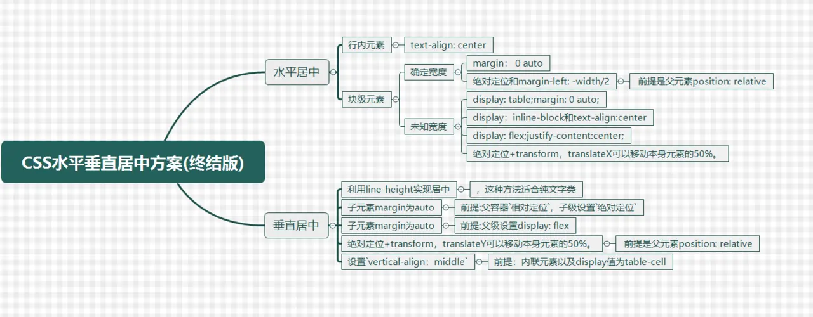

# 居中大法

探究 css 究竟有多少种让元素水平垂直居中的方案



## 水平居中

### 行内元素

代表元素：a 标签、span 标签、文字

居中方法：text-align: center;

它对块级元素不生效，但是块级元素会继承父级元素的 text-align: center; 的样式，使得块级元素的内部文字居中

::: demo 行内元素居中

```html
<div style="width: 200px; border: 1px solid saddlebrown; text-align: center;">
  <span>span</span>
</div>
<div style="width: 200px; border: 1px solid saddlebrown; text-align: center;">
  <a>a标签</a>
</div>
<div style="width: 200px; border: 1px solid saddlebrown; text-align: center;">
  <div style="border: 1px solid saddlebrown; width: 150px;">子块元素</div>
</div>
```

:::

### 块级元素(确定宽度)

（1） margin: 0 auto;

> margin: 0 auto; 会使得块级元素自动计算两侧的 margin 值，并均等分配，让元素居中。

::: demo 块级元素居中

```html
<div style="border: 1px solid blue;">
  <div
    style="width: 100px; height: 100px;margin: 0 auto; background-color: red;"
  ></div>
</div>
```

:::

(2) 父级元素 position: relative; 子元素绝对定位 position:absolute; left:50%; margin-left: -width/2

> 此方法对垂直居中也适用

::: demo 块级元素居中

```html
<div style="position: relative; border:1px solid blue; height:100px;">
  <div
    style="left: 50%; margin-left: -50px; width: 100px; height: 100px; background-color: red; position: absolute;"
  ></div>
</div>
```

:::

### 块级元素(未知宽度)

(1) display:table; margin: 0 auto;

> 你可以把它理解为先转成行内块元素，然后再用 margin: 0 auto;
> ::: demo 块级元素(未知宽度)

```html
<div style="border: 1px solid blue; ">
  <p style="border: 1px solid red; display: table; margin: 0 auto;">
    我是未知宽度的块级元素
  </p>
</div>
```

:::

(2) display: inline-block; text-align:center;
::: demo 块级元素(未知宽度)

```html
<div style="border: 1px solid blue; text-align: center;">
  <div style="border: 1px solid red;  display: inline-block;">
    我是未知宽度的块级元素
  </div>
</div>
```

:::

## 垂直居中

(1) 利用 line-height 实现居中，这种方法适合纯文字类

> 设置 line-height 高度和父元素高度一致
> ::: demo 垂直居中

```html
<p style="height: 100px; border: 1px solid red; line-height: 100px;">
  Hello World
</p>
```

:::

（2）通过设置父容器相对定位，子级设置绝对定位，标签通过 margin 实现自适应居中

（3）弹性布局 flex:父级设置 display: flex; 子级设置 margin 为 auto 实现自适应居中

::: demo 垂直居中

```html
<div style="display:flex; height: 100px; border: 1px solid red;">
  <p style="margin: auto; border: 1px solid blue;">Hello World</p>
</div>
```

:::

## 水平垂直居中

（1）absolute + margin auto + top:0;left:0;right:0;bottom:0;

> 先把整个块级元素撑开，然后自动计算宽高
> ::: demo absolute 水平垂直居中

```html
<div style="position: relative; height: 100px; width: 100%;">
  <p
    style="
    border: 1px solid blue;
    position: absolute;
    width: 100px;
    height: 100px;
    top: 0;
    left: 0;
    right: 0;
    bottom: 0;
    margin: auto;"
  ></p>
</div>
```

:::

（2）flex 方案

::: demo flex 水平垂直居中

```html
<div
  style="display:flex; height: 100px; border: 1px solid red;  align-items: center; justify-content: center; "
>
  <p style="border: 1px solid blue;">Hello World</p>
</div>
```

:::

（3）计算属性
这种方法兼容性依赖 calc 的兼容性，缺点是需要知道子元素的宽高
::: demo flex 水平垂直居中

```html
<div style="position:relative; height: 100px; border: 1px solid red; ">
  <div
    style="
    position: absolute;
    width: 20px;
    height: 20px;    
    top: calc(50% - 10px);
    left: calc(50% - 10px);
    border: 1px solid blue;"
  ></div>
</div>
```

:::

（4）absolute + transform:translateX(-50%)

::: demo 水平垂直居中 transform

```html
<div style="border: 1px solid red; position:relative; height: 100px;">
  <div
    style="position:absolute; left:50%; top:50%; border: 1px solid blue; transform: translate(-50%, -50%);"
  >
    我是未知宽度的块级元素
  </div>
</div>
```

:::

（5）table 方案

::: demo table+inline-block

```html
<div
  style="
    display: table-cell;
    text-align: center;
    vertical-align: middle;
    border: 1px solid red;
    width: 500px;
    height: 100px;"
>
  <div style="border: 1px solid blue; display: inline-block;">
    我是未知宽度的块级元素
  </div>
</div>
```

:::

## 参考文章

[让一个元素水平垂直居中，到底有多少种方案？](http://47.98.159.95/my_blog/blogs/css/001.html#%E6%B0%B4%E5%B9%B3%E5%B1%85%E4%B8%AD)

[10 种水平垂直居中对齐方式](https://www.jianshu.com/p/907f99004c3e)
