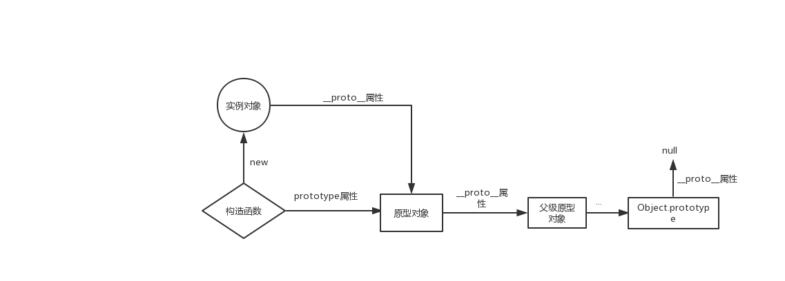

# 原型、原型链和继承

## 原型对象和构造函数

在 JavaScript 中，每当定义一个函数数据类型(普通函数、类)时候，都会天生自带一个 prototype 属性，这个属性指向函数的原型对象。

当函数经过 new 调用时，这个函数就成为了构造函数，返回一个全新的实例对象，这个实例对象有一个**proto**属性，指向构造函数的原型对象。


## 描述一下原型链

JavaScript 对象通过 prototype 指向父类对象，直到指向 Object 对象为止，这样就形成了一个原型指向的链条, 即原型链。

注意点：

- 对象的 hasOwnProperty() 来检查对象自身中是否含有该属性
- 使用 in 检查对象中是否含有某个属性时，如果对象中没有但是原型链中有，也会返回 true
  

## 继承

### 继承的目的

继承父类的成员和属性
使用父类原型上的方法

### 1. 借助 call 来实现继承

```js
function Parent() {
  this.name = "parent";
}

Parent.prototype.sayHello = function () {
  console.log(`hello, I’m ${this.name}`);
};

function Child() {
  Parent.call(this);
  this.type = "child";
}

let parent = new Parent();
let child = new Child();
// Child1 { name: 'parent', type: 'child' }

parent.sayHello(); // hello, I’m parent
child.sayHello(); // TypeError: child.sayHello is not a function
```

上述代码相当于在创建 Child 实例对象的时候，先在开始执行了 Parent.call(this) , 把 Parent 构造函数中的属性绑定到 Child 实例身上，使得 Child 实例拥有 Parent 父类中定义的属性。

但是该方法无法让 Child 实例继承 Parent 父类原型中的方法。

### 2. 原型链继承

为了解决上述问题，引入原型链

```js
function Parent() {
  this.name = "parent";
  this.cars = ["宝马", "奔驰"];
}

Parent.prototype.sayHello = function () {
  console.log(`hello, I’m ${this.name}`);
};

Parent.prototype.age = 18;

function Child() {
  this.type = "child";
}

Child.prototype = new Parent();

let parent = new Parent();
let child = new Child();
// Child { type: 'child' } , 其他属性是父类实例身上的，所以这里不作显示

console.log(child.age, child.cars);
parent.sayHello(); // hello, I’m parent
child.sayHello(); // hello, I’m parent
```

ok, 没问题，看看现在我们能访问（继承）到什么：

1. 继承父类构造函数中定义的属性，即姓名 name

2. 也能使用父类原型中定义的方法，及 sayHello()

3. 甚至能访问父类原型中的属性，年龄 18, 车子 [ '宝马', '奔驰' ]

看上去没啥问题了，我们多来几个孩子试试：

```js
let child1 = new Child();
let child2 = new Child();

// 第一个孩子自己买了一辆五菱宏光
child1.cars.push("五菱宏光");

console.log(child1.cars); // [ '宝马', '奔驰', '五菱宏光' ]
console.log(child2.cars); // [ '宝马', '奔驰', '五菱宏光' ]
```

意外发生了，当其中一个孩子买了一辆五菱宏光后，另外一个孩子也共享了这个五菱宏光，即 cars 引用属性中也多了一个变量，五菱宏光，要知道父亲的东西可以继承，兄弟间的东西可不能随便乱继承。

问题的原因在于两个孩子都继承了同一个实例对象，实例对象中的引用属性都是共享的。

同时，兄弟两的名字都叫 parent 的也略显不妥。

### 3. 组合继承

结合第一种方案和第二种方案（call + 原型链）实现组合继承

```js
function Parent(name) {
  this.name = name;
  this.cars = ["宝马", "奔驰"];
}

Parent.prototype.sayHello = function () {
  console.log(`hello, My name is ${this.name}, I'm ${this.age} years old`);
};

function Child(name, age) {
  Parent.call(this, name);
  this.age = age;
}

Child.prototype = new Parent();

let child1 = new Child("小明", 18);
// Parent { name: '小明', cars: [ '宝马', '奔驰' ], age: 18 }

let child2 = new Child("小红", 16);
// Parent { name: '小红', cars: [ '宝马', '奔驰' ], age: 16 }

child1.sayHello(); // hello, My name is 小明, I'm 18 years old
child2.sayHello(); // hello, My name is 小红, I'm 16 years old
```

这样一来，孩子不仅继承了父类原型上的方法，而且还把父类构造函数上的属性完全拷贝了一份(通过 call 方法)，通过 call 方法还能向父类传参，初始化名字的属性。

好，现在来试试，往两个孩子身上的 cars 属性，增添变量

```js
child1.cars.push("奥迪");
child2.cars.push("五菱宏光");

console.log(child1, child2);

// Parent { name: '小明', cars: [ '宝马', '奔驰', '奥迪' ], age: 18 }
// Parent { name: '小红', cars: [ '宝马', '奔驰', '五菱宏光' ], age: 16 }
```

这回他俩的车是不一样的了，很好理解，因为他们各自在创建实例的时候，创建了新的 cars 引用对象，两个互相不干扰。

### 3.1 优化组合继承

从上述代码可以看到，每次打印子类实例对象的时候，显示他的构造函数都是 Parent ，而子类明明是由 Child 构造而来，只是继承了 Parent 的实例而已。

并且还执行了一次父类实例的创建：`Child.prototype = new Parent()`

废话不多说，show me the code:

```js
...
// 把 Child.prototype = new Parent() 替换成如下代码即可：
Child.prototype = Parent.prototype // 让 Child 的原型直接继承 Parent 类的原型
Child.prototype.constructor = Child // 修复子类原型的构造器的指向


...
console.log(child1, child2)
// Child { name: '小明', cars: [ '宝马', '奔驰', '奥迪' ], age: 18 } Child { name: '小红', cars: [ '宝马', '奔驰', '五菱宏光' ], age: 16 }
```

### 4. 寄生组合继承

嘿嘿，是不是觉得已经完美了？问题又来了，我们修复了子类原型的构造器的指向，同时把父类原型的构造器指向也给改了，会出现如下问题：

```js
function Parent(name) {
  this.name = name;
  this.cars = ["宝马", "奔驰"];
}

Parent.prototype.sayHello = function () {
  console.log(`hello, My name is ${this.name}, I'm ${this.age} years old`);
};

function Child(name, age) {
  Parent.call(this, name);
  this.age = age;
}

Child.prototype = Parent.prototype;
Child.prototype.constructor = Child;

let child1 = new Child("小明", 18);
let child2 = new Child("小红", 16);
let parent = new Parent("小龙", 40);

console.log(child1, child2, parent);
// Child { name: '小明', cars: [ '宝马', '奔驰' ], age: 18 }
// Child { name: '小红', cars: [ '宝马', '奔驰' ], age: 16 }
// Child { name: '小龙', cars: [ '宝马', '奔驰' ] }
```

这下倒好，父类实例的构造器指向也指向了 Child 类，我们想要的效果是父类实例的构造器指向是父类，子类的实例构造器指向是子类，有没有能够实现这样的方案呢？

废话不多说，show me the code:

```js
...

// 原来的 Child.prototype = Parent.prototype
Child.prototype = Object.create(Parent.prototype)

...

console.log(child1, child2, parent)
// Child { name: '小明', cars: [ '宝马', '奔驰' ], age: 18 }
// Child { name: '小红', cars: [ '宝马', '奔驰' ], age: 16 }
// Parent { name: '小龙', cars: [ '宝马', '奔驰' ] }
```

只改了一行代码把`Child.prototype = Parent.prototype`替换成了`Child.prototype = Object.create(Parent.prototype)`

简直太神奇了，看看 Object.create() 做了什么：

```js
// Object.create 的简单实现
Object.prototype.create = function (proto) {
  function F() {}
  F.prototype = proto;
  return new F();
};
```

原来 Object.create 只是弄了一个中转站，创建了一个中间对象，中间对象继承了原来父类的原型，但是正因为由于这个中间对象的存在，使得改变子类原型的构造器指向不会影响到父类。

这种继承就叫做寄生组合继承。

完整的代码如下：

```js
function Parent(name) {
  this.name = name;
  this.cars = ["宝马", "奔驰"];
}

Parent.prototype.sayHello = function () {
  console.log(`hello, My name is ${this.name}, I'm ${this.age} years old`);
};

function Child(name, age) {
  Parent.call(this, name);
  this.age = age;
}

Child.prototype = Object.create(Parent.prototype);
Child.prototype.constructor = Child;

let child1 = new Child("小明", 18);
let child2 = new Child("小红", 16);
let parent = new Parent("小龙", 40);

console.log(child1, child2, parent);
```
