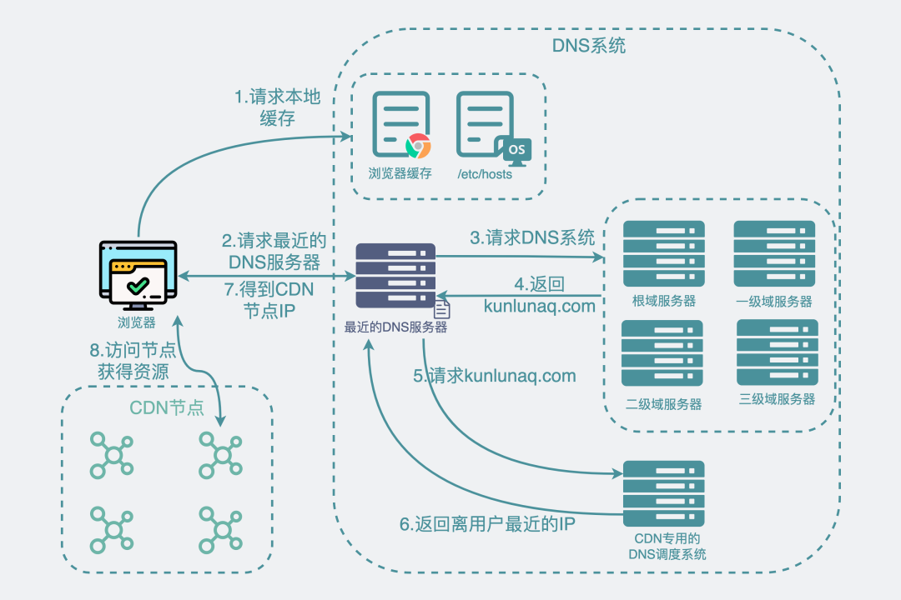
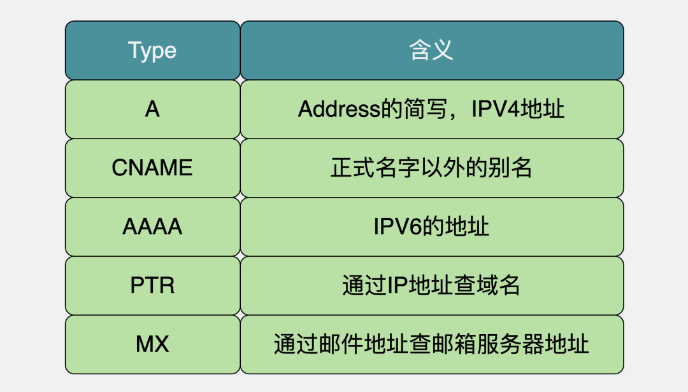
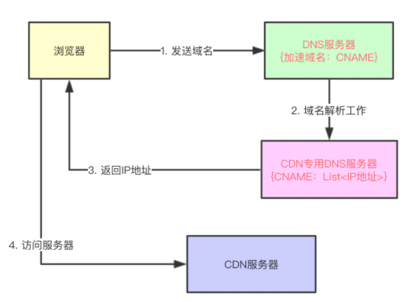
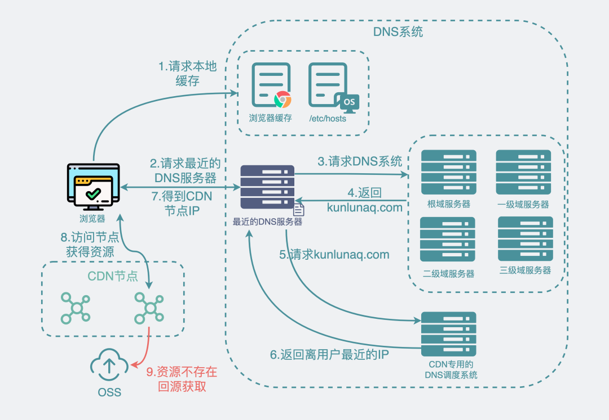
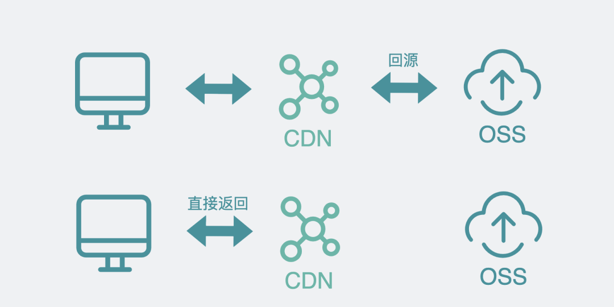
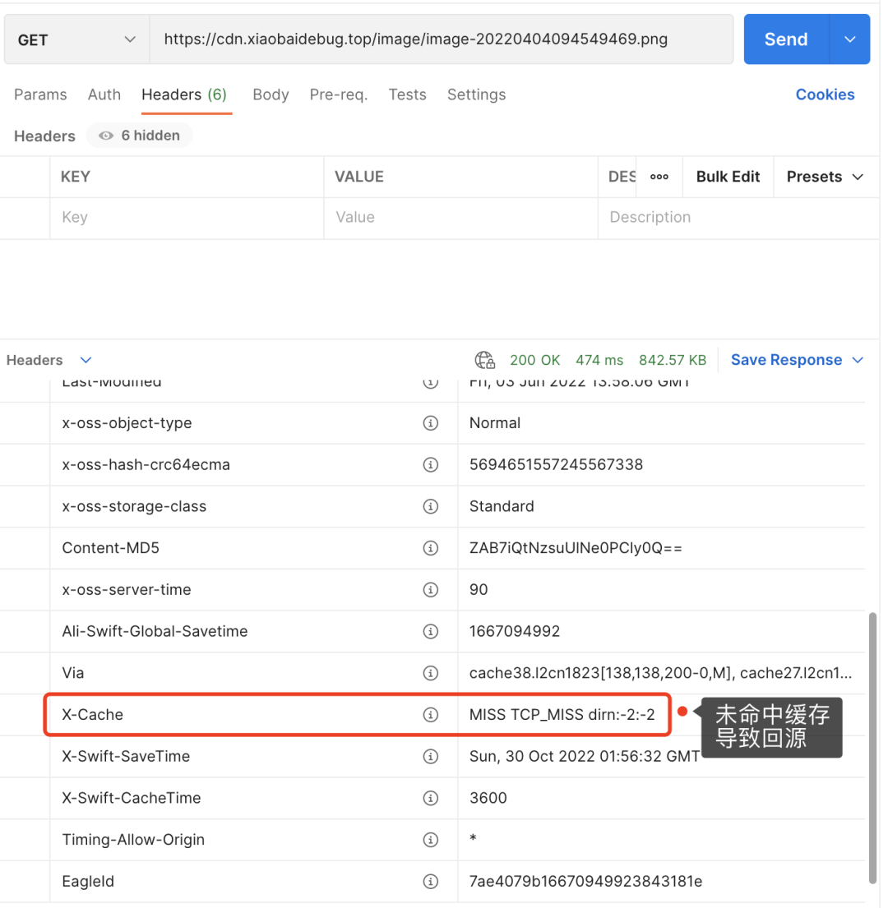
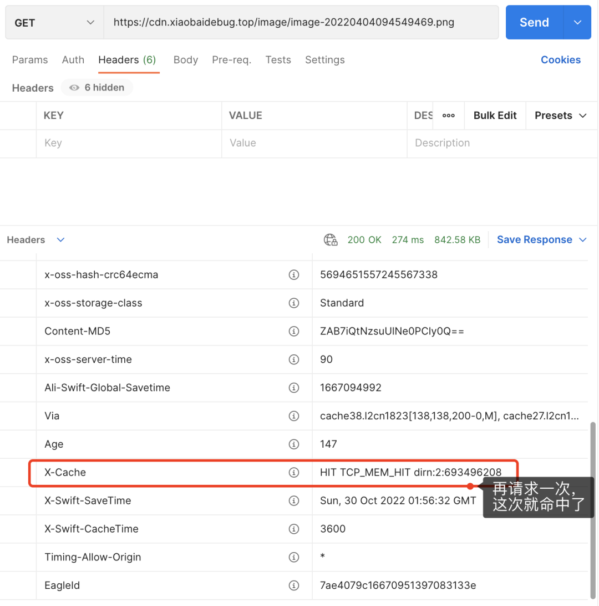
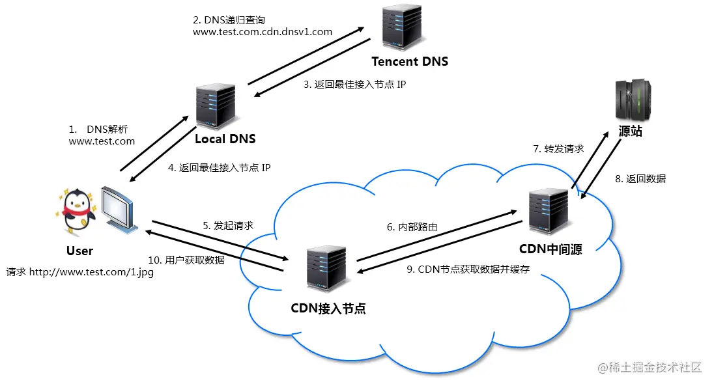

# CDN

## 概念

CDN (全称 Content Delivery Network)，即内容分发网络

构建在现有网络基础之上的智能虚拟网络，依靠部署在各地的边缘服务器，通过中心平台的负载均衡、内容分发、调度等功能模块，使用户就近获取所需内容，降低网络拥塞，提高用户访问响应速度和命中率。CDN 的关键技术主要有内容存储和分发技术

简单来讲，CDN 就是根据用户位置分配最近的资源

于是，用户在上网的时候不用直接访问源站，而是访问离他“最近的”一个 CDN 节点，术语叫边缘节点，其实就是缓存了源站内容的代理服务器。

**访问 CDN 资源全流程图**

## CDN 查询流程

第一阶段：

1. 通过 DNS 服务获取 IP

   - dns 服务，先查看浏览器缓存、查看操作系统 hosts 缓存

   - 如果没有缓存，就去查询根域名、一级域名、二级域名，三级域名服务器以此类推

2. 最近的 DNS 服务器会提供 cdn.ali.top 域名的别名（CNAME 记录），例如 cdn.ali.top.kunlunaq.com

3. cdn.ali.top.kunlunaq.com 就是阿里 CDN 专用的 DNS 调度系统

4. DNS 调度系统会根据你的 IP 地址返回一个离你最近的 IP 地址

第二阶段：

1. 浏览器拿到 IP 去访问响应的 CDN 节点，CDN 节点返回数据

专业名词解析：

## 原理分析

在没有应用 CDN 时，我们使用域名访问某一个站点时的路径为

> 用户提交域名 → 浏览器对域名进行解释 → DNS 解析得到目的主机的 IP 地址 → 根据 IP 地址访问发出请求 → 得到请求数据并回复

应用 CDN 后，DNS 返回的不再是 IP 地址，而是一个 CNAME(Canonical Name ) 别名记录，指向 CDN 的全局负载均衡

CNAME 实际上在域名解析的过程中承担了中间人（或者说代理）的角色，这是 CDN 实现的关键

### 负载均衡系统

由于没有返回 IP 地址，于是本地 DNS 会向负载均衡系统再发送请求 ，则进入到 CDN 的全局负载均衡系统进行智能调度：

看用户的 IP 地址，查表得知地理位置，找相对最近的边缘节点

看用户所在的运营商网络，找相同网络的边缘节点

检查边缘节点的负载情况，找负载较轻的节点

其他，比如节点的“健康状况”、服务能力、带宽、响应时间等

结合上面的因素，得到最合适的边缘节点，然后把这个节点返回给用户，用户就能够就近访问 CDN 的缓存代理

整体流程如下图：

## 为什么需要 CNAME

CNAME 指向的是 CDN 专用的 DNS 域名服务器，对于整个 DNS 系统来说，它和其他域名服务器一样，平平无奇。DNS 请求也会正常打入这个服务。

但当请求真正打到它上面的时候，它的特别之处就体现出来了，当查询请求打入域名服务器时，普通的 DNS 域名服务器返回域名对应的部分 IP 就够了，但 CDN 专用的 DNS 域名服务器却会要求返回离调用方"最近的"服务器 IP。

## 怎么知道哪个服务器 IP 里调用方”最近“？

可以看到"最近"这个词其实是加了双引号的。

CDN 专用的 DNS 域名服务器其实是 CDN 提供商提供的，比如阿里云当然知道自己的的 CDN 节点有哪些，以及这些 CDN 服务器目前的负载情况和响应延时甚至权重啥的，并且也能知道调用方的 IP 地址是什么，可以通过调用方的 IP 知道它所属的运营商以及大概所在地，根据条件筛选出最合适的 CDN 服务器，这就是所谓的"最近"。

举个例子。假设地理位置最近的 CDN 机房流量较多，响应较慢，但地理位置远一些的服务器却能更好的响应当前请求，那按理说可能会选择地理位置远一些的那台 CDN 服务器。

也就是说，选出来的服务器不一定在地理位置最近，但一定是当前最合适的服务器。

## 什么是 CDN 回源

OSS 对象存储才是数据源，当第一次访问 cdn 获取某张图片时，大概率在 cdn 里并没有这张图片的数据，因此需要回到数据源那去取出这份图片数据。然后再放到 cdn 上。下次再次访问 cdn 时，只要缓存不过期，就能命中缓存直接返回，这就不需要再回源。

除了上面提到的 cdn 上拿不到数据会回源站外，还有 cdn 上的缓存过期失效了也会导致回源站。

## 如何判断是否回源

通过 GET 方法去请求图片数据。

然后通过下面的 tab 切换查看 response header 信息。

查看 response header：

回源的情况
此时查看 response header 下的 X-Cache 的值是 MISS TCP_MISS。意思是未命中缓存导致 CDN 回源查 oss，拿到数据后再返回。

那此时 CDN 里肯定是有这张图片的缓存了。我们可以试着再执行一次 GET 方法获取图片。

## 用了 CDN 一定比不用的更快吗？

不一定。更新走了 CDN 还回源。相当于在原来的流程上还多了一层 CDN 的调用流程。

也就是，用了 CDN 时，未命中 CDN 缓存导致回源，就会比不用的时候更慢。

未命中缓存，可能是 cdn 里压根就没这一数据，也可能是曾经有这条数据但后来过期失效了。

这两种情况都正常，大部分时候并不需要做任何处理。

但对于极个别场景，我们可能需要做些优化。比如你们源站数据有大版本更新，就像更换 cdn 域名啥的，那在上线的那一刻用户全用新 cdn 域名去请求图片啥的，新 CDN 节点基本上百分百触发回源，严重的时候甚至可能会拖垮对象存储。这时候你可能需要提前将热点数据筛选出来，利用工具预先请求一波，让 CDN 加载上热数据缓存。比如某里云上的 CDN 就有这样的"刷新预热"功能。

## 什么情况下不该用 CDN？

- 资源不太可能被多次重复调用

- 内网服务

## 总结

• 对于文本类数据我们习惯用 mysql 做存储，redis 做缓存。但属于文件类数据，比如视频图片，则需要使用 oss 等做对象存储，cdn 做缓存。

• 用了 CDN 如果发生回源，那实际上会比不用的时候更慢一些。

• CDN 最大的优势在于，对于来自世界各地的用户，它可以就近分配 CDN 节点获取数据，并且多次重复获取同一个文件数据的时候，有缓存加速的作用。如果你的服务和对象存储都在内网，并且文件数据也不太会有重复使用的可能性，那其实没必要接入 cdn。

## 面试题：CDN 是如何解析到离用户最近的边缘节点？

**根据用户的 IP 地址**，DNS 服务器返回与其距离最近的可用节点的 IP 地址。这种方式通常基于地理位置和网络测量来选择最佳节点，从而确保用户连接到最近的边缘节点。

- 利用 CNAME 的能力，把对 www.test.com 域名的解析变成对特定 CDN 域名的解析，如下图中的 `www.test.com.cdn.dnsv1.com`

- CDN 服务商维护着一个巨大而精确的 IP 地址数据库，能够根据用户客户端的 IP 判断出客户端所在地、网络运营商等信息

- 当解析 `www.test.com.cdn.dnsv1.com` 域名 IP 时，会向 CDN 服务的 DNS 域名发起请求，此时 CDN 服务的 DNS 域名可以根据用户客户端 IP 返回一个离它最近的缓存服务器 IP

### 分析 dns 查询过程

可以使用 `dig + 域名地址` 的命令查看域名解析的过程

## 参考资料

[CDN 是如何解析到离用户最近的边缘节点？](https://juejin.cn/post/7027847808442957831)

[六问 CDN](https://blog.csdn.net/kevin_tech/article/details/131098826)
