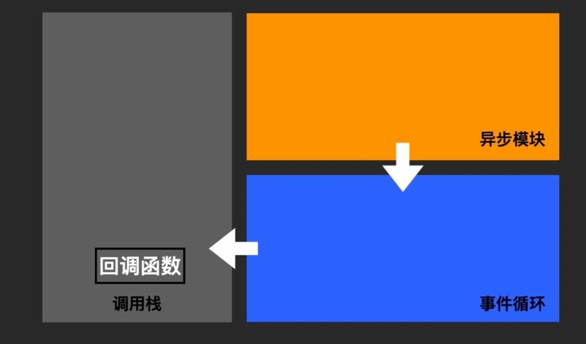

# Node.js

## 要点

- 非阻塞
- 事件循环
- 异常处理
- 模块系统
- 异步编程与流
- npm
- 模块系统
- buffer
- stream
- 事件模式

## 非阻塞

事件循环：负责监听异步模块和派发任务

异步模块(多线程)： 耗时 I/O->异步操作->回调函数->事件循环->按照顺序推动到调用栈



## [事件循环](../Browser/eventloop.md)

## 异常处理

捕获并处理每一个错误。否则进程挂了。

同步代码：

```js
try {
  // 执行
} catch {}
```

异步代码：

- promise, .catch() 方法捕获这个错误

- async/await, try catch

```js
// 处理未捕获异常
process.on("uncaughtException", () => {});
// 处理未捕获的 promise 异常
process.on("unhandledRejection", () => {});
```

使用 nodemon，pm2 来管理 node 进程

## 异步编程和流程控制

- 回调函数 -> promise -> async/await

## 模块系统

### commonJS （流行）

1. 每个文件都是一个独立模块，每个模块都有一个 module 对象用来记录模块信息

2. 通过 `module.exports` 或者 `exports` 可以导出模块

3. 通过 `require()` 可以导入项目

### ES module （未来）

在 package.json 中，配置 type="module"

### 模块

核心模块：核心模块随 node 一起安装，不需要额外的安装，可以直接引用

第三方模块：需要 npm 安装的模块，安装位置是 node_modules

自定义模块：我们自己定义的模块，引用是需要写路径

### 区别

- commonJS 运行时加载，执行的时候才加载，require 可以放在代码的任意位置

- ES module 预编译时加载，可以更早地发现错误。
  - import xx from
  - import 函数，异步函数，返回的是 promise 对象
  - 有向图

[课程](https://www.bilibili.com/video/BV1vB4y197xU/?spm_id_from=333.788&vd_source=e3b06273d67da30202e9861b00e040a5)

## buffer

buffer 对象用来操作二进制数据，长文本、大文件、图片、音频

字符串在 JavaScript 里是不可变的，操作字符内存占用大，而对于 buffer 对象可以直接像数组一样修改数据

```js
// 创建 buffer
const buffer = Buffer.alloc(size, fill, (encoding = "utf-8"));

// 转换成字符串
console.log(buffer.toString());

// 类数组
console.log(buffer.length);
buffer[0] = 72;
buffer.slice();
```

## stream

Stream 是 Node 核心模块。平时使用的都是对 Stream 的封装。

- http
  - req
  - res
- fs(把文件转换为流对象)
  - createReadStream
  - createWriteStream
- zlib
  - 流模式：一边读文件，一边解压缩，一边写入磁盘
- crypto

Stream 的应用场景就是 I/O 操作，处理端到端的数据交换

缓冲模式：程序把需要处理的资源从磁盘加载到内存区域，等所有数据加载后再进行后续处理。

流模式：程序只要加载到数据就会立刻处理，加载一点，处理一点，把资源分成一小小的一块，将数据块源源不断地传给调用端

Stream：

- Readable 可读流

  - readble 事件、resume 事件、data 事件、close 事件、end 事件、error 事件

- Writable 可写流

  - close、finish、drain、error

- Duplex 双工流

  - transform 流

  - passThrough 流

- 流之间的交互 pipe 管道

  - 管道（Pipe）是一种将可读流和可写流连接起来的机制。通过创建一个管道，可以将数据从一个可读流传输到一个可写流，从而实现数据的传输和转换。在管道中，数据会以流式的方式通过数据管道，直到全部数据被传输完毕。

```js
const { Readable } = require("stream");

new Readable({
  // 可读缓存区的最大字符
  highWaterMark: 16 * 1024,
  encoding: null,
  objectMode: false,
  // 将流push到缓冲区，内部调用
  read: function () {},
});
```

## 事件模式

EventEmitter 观察者模式

- on：用于注册监听器
- once：注册一次性监听器
- emit：触发事件，同步地调用监听器
- removeListener：移除某个事件的监听器

监听器实际上就是一个数组，触发事件按注册的顺序执行

支持链式调用

```js
const E = new EventEmitter();

E.on("foo", function a() {
  console.log(11);
}).on();
```
