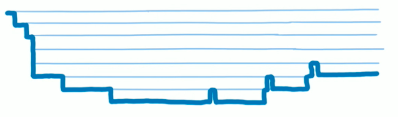
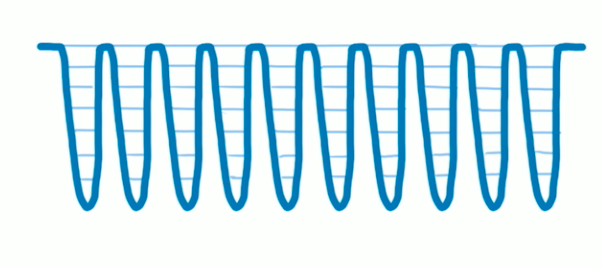

# fiber 架构

## fiber 是什么?

React Fiber 是对核心算法的一次重新实现。
Fiber 包含三层含义：

- 作为架构来说，从 React 15 的 Stack Reconciler（递归调用栈） 升级为 Fiber Reconciler， 这是对核心算法的重构，实现异步可中断更新的特性

- 作为数据结构来说，它表示一个 React element，它保存了组件的类型（函数组件/类组件/原生组件）对应的 DOM 节点信息

- 作为动态工作单位来说，每个 FiberNode 保存了本次更新中该组件改变的状态、以及要执行的工作（增删改）

无论作为数据结构还是工作单位，它都是以 FiberNode 的身份存在，因为 React 16 的架构我们命名为 Fiber，所以它的协调器就是 Fiber Reconciler，它作为 React Element 或者最小工作单位，就叫做 FiberNode

## 引入 fiber 的目的

将 React 15 中的同步递归无法中断的更新重构为异步可中断的更新。React 16 引入 fiber 后的特性如下：

1. 异步渲染和任务优先级：React 的 fiber 架构使得实现异步渲染和任务优先级变得容易。

2. 更好的中断和恢复机制：Fber 架构提供了一种更灵活的中断和恢复机制，允许 React 在渲染的过程中暂停、中断，然后根据优先级恢复。

3. 增量更新：Fiber 允许 React 实现增量更新，即只更新变化的部分而不必重新渲染整个组件树。

## 新老版本架构对比

### React 15 架构

React 15 的架构：

- Reconciler （协调器）：负责找出变化的组件，它的特点是当主动或者被动触发更新组件（如改变 props、state）时，组件是树状结构，会递归执行更新。当组件层级很深，递归更新时间超过 16ms，就会呈现卡顿现象。

- Renderer（渲染器）：负责将变化的组件渲染到页面上，不同平台有不同的渲染器（React DOM Renderer、React Native Renderer、React Art Renderer）

### React 16 架构

React 16 架构：

- Scheduler（调度器）：React 实现了功能更完备的 requestIdleCallbackpolyfill，这就是 Scheduler。除了在空闲时触发回调的功能外，Scheduler 还提供了多种调度优先级供任务设置

- Reconciler（协调器）

- Renderer（渲染器）

## 区别

React 16 架构相较于 React 15，多了 Scheduler（调度器），正是因为调度器，才使得 React 有了能够中断任务、切片、调整优先级等能力。

### Scheduler 调度器的作用

从浏览器的角度来说：

JavaScript 是单线程语言，意味着它有依次执行代码的特点，打个比喻，就像排队打饭，执行完一个函数再轮到下一个，挨个执行

所以我们可以得到这样的一个画面，React15 在渲染大组件时，因为 JavaScript 单线程的特性，要把大组件下的所有子组件进行递归计算，当计算时间超过了 16ms，就产生卡顿现象



所以只要我们设置一种机制，将一个耗时长的任务分成很多小任务，按照优先级顺序依次执行，当计算时间超过 16ms，就交由 GUI 绘制，绘制一会儿再由渲染线程接管，执行 JS。React 的 Scheduler（调度器）再按照优先级分配，看有没有紧急任务，如果没有就继续更新，有的话就执行紧急任务，完成紧急任务后就按照优先级继续完成剩余任务。当执行时间再到 16ms 时，再交给 GUI 绘制，如此反复，就能瞒过肉眼，感觉运行流畅

这个技术称作时间分片，即讲一个渲染工作分解成多个小任务，并在多个帧之间分配和执行这些任务。



这种在浏览器空闲的时候调用的方法部分浏览器（目前看就 Safari 不支持）中已经实现，即 requestIdleCallback

React 团队考虑到浏览器兼容性以及 requestIdleCallback 的触发频率不稳定等原因，所以自己写了个 requestIdleCallback polyfill（垫平），其技术用的是 MessageChannel。Scheduler 除了空闲时触发回调的功能外，还提供了多种调度优先级功能

### 调度器的优先级

React 中调度器的不同优先级极其排序

- Immediate：最高优先级，会马上执行的不能中断

- UserBlocking：一般用户交互结果，需要及时反馈

- Normal：普通等级，比如网络请求等不需要用户立即感知的

- Low：低优先级，这种可以延后，最后要执行

- Idle：最低优先级，可以被无限延迟，比如 console

总得来说，Scheduler 调度器包含了两大功能，一是时间切片、二是优先级调度；时间切片是通过 Fiber 架构下的 Fiber 节点实现，因为是链表结构，所以它能在你中断执行后记录下并在另一个小任务执行时续上；任务调度顾名思义，优先级较高的插队执行

### Reconciler（协调器）

在讲 React 15 的 Reconciler 时，我们讲到它是递归处理虚拟 DOM，React 16 中的 Reconciler 则从递归变成了可以中断的循环过程。每次循环都会调用 shouldYield 判断当前是否有剩余时间

```js
function workLoopConcurrent() {
  // Perform work until Scheduler asks us to yield
  // 直到调度程序要求我们让步之前继续工作
  while (workInProgress !== null && !shouldYield()) {
    // $FlowFixMe[incompatible-call] found when upgrading Flow
    //在升级 Flow 时发现了 $FlowFixMe[incompatible-call]
    performUnitOfWork(workInProgress);
  }
}
```

### Renderer（渲染器）

就是将 Reconciler 打上标签的虚拟 DOM 对象（即 FiberNode）执行成 DOM（Virtual DOM 变 视图）

简单来说，React 16 的 Fiber 架构就是先通过调度器将高优先级的任务 push 到协调器中的就绪任务队列中，协调器对其打标签，找出需要变化的组件，最后由渲染器将变化的组件渲染到页面

## Fiber 实现原理

### FiberNode 的结构

```js
function FiberNode(
  this: $FlowFixMe,
  tag: WorkTag,
  pendingProps: mixed,
  key: null | string,
  mode: TypeOfMode
) {
  // Instance 作为静态数据结构的属性
  this.tag = tag;
  this.key = key;
  this.elementType = null;
  this.type = null;
  this.stateNode = null;

  // Fiber 用于连接其他 FiberNode 形成 Fiber Tree
  this.return = null;
  this.child = null;
  this.sibling = null;
  this.index = 0;

  this.ref = null;
  this.refCleanup = null;

  // 作为动态的工作单元的属性
  this.pendingProps = pendingProps;
  this.memoizedProps = null;
  this.updateQueue = null;
  this.memoizedState = null;
  this.dependencies = null;

  this.mode = mode;

  // Effects
  this.flags = NoFlags;
  this.subtreeFlags = NoFlags;
  this.deletions = null;

  // 调度优先级相关
  this.lanes = NoLanes;
  this.childLanes = NoLanes;

  // 指向该fiber在另一次更新时对应的fiber
  this.alternate = null;
}
```

### Fiber 是如何实现更新过程可控

更新过程的可控体现在下面几个方面：

- 任务拆分

- 任务挂起、恢复、终止

- 任务具备优先级

#### 任务拆分

在 React Fiber 机制中，它采用 "化整为零"的思想，将调和阶段（Reconciler） 递归遍历 VDOM 这个大任务分成若干个小任务，每个任务只负责一个节点的处理。

#### 任务挂起、恢复、终止

- workInProgress tree

workInProgress 代表当前正在执行的 Fiber 树。在 render 或者 setState 后，会构建起一颗 Fiber 树，也就是 workInProgress tree，这棵树在构建的每一个节点的时候会收集当前节点的副作用，整棵树构建完成后，会形成一条完整的副作用链。

- currentFiber tree

currentFiber 表示上次渲染构建的 Fiber 树。在每一次更新完成后 workInProgress 会赋值给 currentFiber。在新一轮更新时 workInProgress tree 再重新构建，新 workInProgress 的节点通过 alternate 属性和 currentFiber 的节点建立联系。

在新 workInProgress tree 的创建过程中，会同 currentFiber 的对应节点进行 Diff 比较，收集副作用。同时也会复用和 currentFiber 对应的节点对象，减少新创建对象带来的开销。也就是说无论是创建还是更新、挂起、恢复以及终止操作都是发生在 workInProgress tree 的创建过程中的。workInProgress tree 的构建过程其实就是循环的执行任务和创建下一个任务。

**挂起**

当第一个小任务完成后，先判断这一帧是否还有空闲时间，没有就挂起下一个任务的执行，记住当前挂起的节点，让出控制权给浏览器执行更高优先级的任务。

**恢复**

在浏览器渲染完一帧后，判断当前帧是否有剩余时间，如果有就恢复执行之前挂起的任务。如果没有任务需要处理，代表调和阶段完成，可以开始进入渲染阶段。

- 如何判断一帧是否有空闲时间？

使用 RequestIdleCallback 浏览器原生 API，React 源码中为了兼容低版本浏览器，对该方法进行了 Polyfill.

- 恢复执行的时候又是如何知道下一个任务是什么呢？

链表。React Fiber 中每个任务其实就是在处理一个 FiberNode 对象，然后又生成下一个任务需要处理的 FiberNode。

**终止**

其实并不是每次更新都会走到提交阶段。当在调和过程中触发了新的更新，在执行下一个任务的时候，判断是否有优先级更高的执行任务，如果有就终止原来将要执行的任务，开始新的 workInProgressFiber 树构建的过程，开始新的流程。这样可以避免重复更新操作。

#### 任务具备优先级

React Fiber 除了通过挂起，恢复和终止来控制更新外，还给每个任务分配了优先级，具体点就是在创建或者更新 FiberNode 的时候，通过算法给每一个任务分配一个到期时间（expirationTime）。在每个任务执行的时候除了判断剩余时间，如果当前处理节点已经过期，那么无论现在是否有空闲时间都必须执行该任务。过期时间的大小还代表着任务的优先级。

任务在执行过程中顺便收集了每个 FiberNode 的副作用，将有副作用的节点通过 firstEffect、lastEffect、nextEffect 形成一条副作用单链表。
A1(next)-B1(next)-C1(next)-C2

其实最终都是为了收集到这条副作用链表，有了它，在接下来的渲染阶段就通过遍历副作用链完成 DOM 更新。这里需要注意，更新真实 DOM 的这个动作是一气呵成的，不能中断，不然会造成视觉上的不连贯（commit）。

## 参考文章

[Fiber 的作用和原理](https://fe.azhubaby.com/React/Fiber.html)
