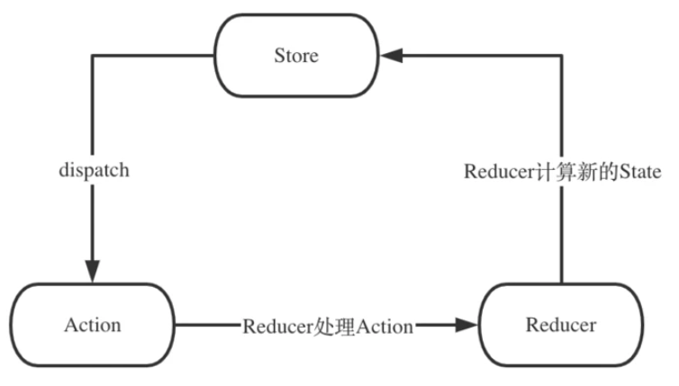
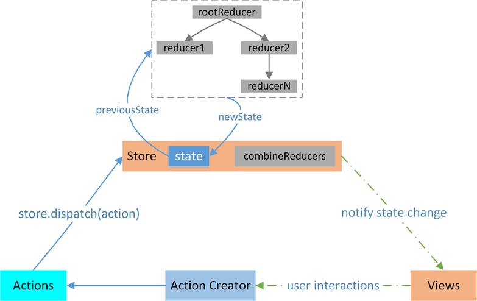
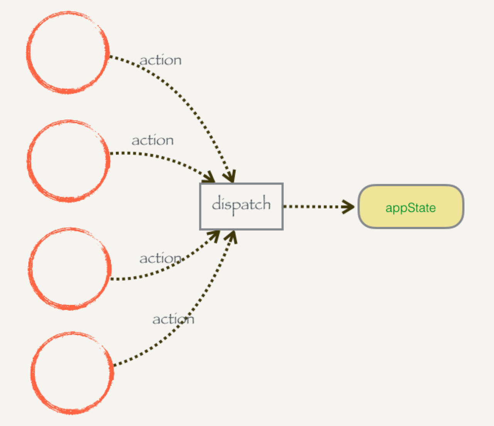

# redux

## 介绍

React 是用于构建用户界面的，帮助我们解决渲染 DOM 的过程

而在整个应用中会存在很多个组件，每个组件的 state 是由自身进行管理，包括组件定义自身的 state、组件之间的通信通过 props 传递、使用 Context 实现数据共享

如果让每个组件都存储自身相关的状态，理论上来讲不会影响应用的运行，但在开发及后续维护阶段，我们将花费大量精力去查询状态的变化过程

这种情况下，如果将所有的状态进行集中管理，当需要更新状态的时候，仅需要对这个管理集中处理，而不用去关心状态是如何分发到每一个组件内部的

redux 就是一个实现上述集中管理的容器，遵循三大基本原则：

- 单一数据源

- state 是只读的

- 使用纯函数来执行修改

## 定义

1. redux 一种架构模式是用于数据状态管理，继承了单向数据流的理念，而 react 是一个视图层面的库。

2. 如果将两者连接在一起，就是官方推荐的 react-redux 状态管理库，其具有高效且灵活的特性

3. 简要来说，Redux 主要是为了解决状态共享的问题，提供可预测的状态管理

   - 当需要数据共享的时候，React 的一般性做法是状态提升，提到两个组件最近的父组件，但是随着嵌套层级的加深，根组件要管理的 state 会越来越多，不方便维护。

   - Context 出现就是为了能够实现“远方组件”的数据共享。它的缺点是使用 context 的所有组件都可以修改 context 里面的共享状态，导致程序的运行不可预测

   - Redux 是为了解决 "模块（组件）之间需要共享数据"和“数据可能被任意修改导致不可预料的结果”之间的矛盾。

4. 设计与构成



注：redux 中不包含视图层的部分

## 工作原理

redux 要求我们把数据都放在 store 公共存储空间

一个组件改变了 store 里的数据内容，其他组件就能感知到 store 的变化，再来取数据，从而间接的实现了这些数据传递的功能

工作流程图如下所示：



根据流程图，可以想象，React Components 是借书的用户， Action Creactor 是借书时说的话(借什么书)， Store 是图书馆管理员，Reducer 是记录本(借什么书，还什么书，在哪儿，需要查一下)， state 是书籍信息

整个流程就是借书的用户需要先存在，然后需要借书，需要一句话来描述借什么书，图书馆管理员听到后需要查一下记录本，了解图书的位置，最后图书馆管理员会把这本书给到这个借书人

转换为代码是，React Components 需要获取一些数据, 然后它就告知 Store 需要获取数据，这就是就是 Action Creactor , Store 接收到之后去 Reducer 查一下， Reducer 会告诉 Store 应该给这个组件什么数据。

### store

- 通过 createStore 生成 store 实例，store 实例有如下 API：

  - store.getState 得到唯一值 state

  - store.dispatch 动作行为，改变 store 中数据的唯一途径

  - store.subscribe 订阅（发布订阅模式）

- createStore 传参：initState, reducer

  - initState, 初始的 state 对象

  - reducer，纯函数，传入 state 和 action，返回新的 state

### dispatch 和 action

所有对数据的操作必须通过 dispatch 函数。它接受一个参数 action ，这个 action 是一个普通的 JavaScript 对象，里面必须包含一个 type 字段来声明你到底想做什么。dispatch 在 switch 里面识别这个 type 字段，识别出操作执行对 state 的修改



### 实现 Redux

极简 redux，23 行。

```js
export const createStore = (initState, reducer) => {
  let state = initState;
  let listeners = [];

  const subscribe = (fn) => {
    listeners.push(fn);
  };

  const dispatch = (action) => {
    state = reducer(state, action); // 更新 state 并执行发布
    listeners.forEach((fn) => fn());
  };

  const getState = () => {
    return state;
  };

  return {
    getState,
    subscribe,
    dispatch,
  };
};
```

测试代码

```js
...

const initState = {
  count: 0,
};

const reducer = (state, action) => {
  switch (action.type) {
    case "INCREMENT":
      return {
        ...state,
        count: state.count + 1,
      };
    case "DECREMENT":
      // 返回新的对象，state 引用更新，但执行浅拷贝，内部的引用对象若未更新仍相同，可以优化性能
      return {
        ...state,
        count: state.count - 1,
      };

    default:
      return state;
  }
};
const store = createStore(initState, reducer);

store.subscribe(() => {
  let state = store.getState();
  console.log("state", state);
});

store.dispatch({
  type: "INCREMENT",
});

store.dispatch({
  type: "DECREMENT",
});

```

### Redux 中间件

Redux 的 createStore 共有三个参数

```js
createStore([reducer], [initial state], [enhancer]);
```

完整版：

```js
// 记录日志
const loggerMiddleware = (store) => (next) => (action) => {
  console.log("this.state", store.getState());
  console.log("action", action);
  next(action);
  console.log("next state", store.getState());
};

// 记录异常
const exceptionMiddleware = (store) => (next) => (action) => {
  try {
    next(action);
  } catch (error) {
    console.log("错误报告", error);
  }
};

// 时间戳
const timeMiddleware = (store) => (next) => (action) => {
  console.log("time", new Date().getTime());
  next(action);
};

// 三层闭包
// 第一层：缓存 middlewares
// 第二层：缓存旧的 crateStore 方法
// 第三层：缓存函数，装饰过的 newstore
const applyMiddleware = (...middlewares) => {
  return (oldCreateStore) => {
    return (initState, reducer) => {
      // 拿到旧的 createStore 的 store
      const store = oldCreateStore(initState, reducer);

      // 中间件
      // 第一层给每个中间件传入 store
      // 第二层给每个中间件传入 dispatch 派发器
      // 第三层传入 action
      const chain = middlewares.map((middleware) => middleware(store));

      let dispatch = store.dispatch;

      // 装饰 dispatch，每个中间件传入原派发器，赋值中间件改造后的dispatch，这里运用了洋葱模型，层层包裹，action 被逐级传递
      chain.reverse().map((middleware) => (dispatch = middleware(dispatch)));

      store.dispatch = dispatch;

      return store;
    };
  };
};

const createStore = (initState, reducer, enhancer) => {
  // 装饰器
  if (enhancer) {
    return enhancer(createStore)(initState, reducer);
  }

  let state = initState;

  const listeners = [];

  const subscribe = (fn) => {
    listeners.push(fn);
  };
  const dispatch = (action) => {
    state = reducer(state, action);

    listeners.forEach((fn) => fn());
  };

  const getState = () => {
    return state;
  };

  return {
    subscribe,
    dispatch,
    getState,
  };
};

const initState = {
  count: 0,
};

const reducer = (state, action) => {
  switch (action.type) {
    case "INCREMENT":
      return {
        ...state,
        count: state.count + 1,
      };
    case "DECREMENT":
      return {
        ...state,
        count: state.count - 1,
      };

    default:
      return state;
  }
};
const store = createStore(
  initState,
  reducer,
  applyMiddleware(loggerMiddleware, exceptionMiddleware, timeMiddleware)
);

store.subscribe(() => {
  let state = store.getState();
  console.log("执行订阅操作", state);
});

store.dispatch({
  type: "INCREMENT",
});

store.dispatch({
  type: "DECREMENT",
});
```

## Redux combineReducers

把 reducers 合并

## 实现 React Redux

使用过 redux 的同学都知道，redux 作为 react 公共状态管理工具，配合 react-redux 可以很好的管理数据，派发更新，更新视图渲染的作用，那么对于 react-redux 是如何做到根据 state 的改变，而更新组件，促使视图渲染的呢，让我们一起来探讨一下，react-redux 源码的奥妙所在

React-redux 分成了两大核心：

- connection 高阶组件

- Provider 组件

### Provider

在 redux 中存在一个 store 用于存储 state，如果将这个 store 放在顶层元素中，其他组件都被包裹在顶层元素之内，其实就是提供一个 context 供其他组件读取使用。

### connection

connection 就是一个高阶组件

connect 方法将 store 上的 getState 和 dispatch 包装成 props

用法如下：

```js
import { connect } from "react-redux";

connect(mapStateToProps, mapDispatchToProps)(MyComponent);
```

#### mapStateToProps

把 redux 中的数据映射到 react 中的 props 中去，组件就能通过 props 获取到 store 中的数据。

#### mapDispatchToProps

把 redux 中的 dispatch 映射到组件内部的 props 中去，组件就能通过 props 执行 dispatch 封装的相关方法。

#### 总结

把 context 和 store 结合起来，组件中只能通过 dispatch 来进行修改，这样的话，每个组件既可以去 context 里面获取 store 从而获取状态，又不用担心它们乱改数据

## 面试题

### 说说你对 redux 的理解？其工作原理？

### 可以用 useReducer 替代 redux 吗

虽然在 React hooks 项目中,可以使用 useReducer 来部分替代 Redux 的功能,但它并不能完全替代 Redux。以下是一些可能会遇到的问题:

1. 复杂的状态管理: Redux 提供了一个集中式的状态管理系统,可以更好地管理复杂的状态。而 useReducer 更适合于管理组件内部的状态。当状态变得非常复杂时,使用 useReducer 可能会导致组件变得臃肿和难以维护。

2. 跨组件状态共享: Redux 提供了强大的状态共享机制,可以很容易地在组件之间共享状态。使用 useReducer 时,需要手动在组件之间传递状态和更新函数,这可能会增加代码的复杂性。

3. 中间件和插件生态: Redux 有一个丰富的中间件和插件生态系统,可以为状态管理提供更多的功能,例如异步操作、时间旅行调试等。useReducer 本身并没有这样的生态系统支持。

4. 测试和调试: Redux 提供了更好的测试和调试支持,因为它有一个单一的状态树。使用 useReducer 时,需要手动测试和调试每个组件的状态管理逻辑。

5. 代码组织和可维护性: 在大型项目中,Redux 提供了更好的代码组织方式,使得项目的可维护性更强。而使用 useReducer 时,需要自己管理每个组件的状态管理逻辑。

因此,对于一些小到中型的项目,使用 useReducer 可能是一个不错的选择,但对于大型复杂的项目,仍然建议使用 Redux 作为全局状态管理库。当然,您也可以在项目中同时使用 useReducer 和 Redux,将局部状态管理交给 useReducer，将全局状态管理交给 Redux。这样可以充分利用两者的优势。

### 你在 React 项目中如何使用 redux 的？项目结构如何划分？
