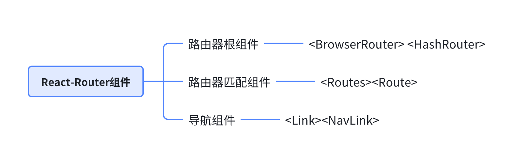

# React Router

## 概念

Web 应用原本是后端路由，即由服务器根据浏览器 URL 渲染指定的页面。后来随着技术发展，前端演化出单页应用(SPA)，路由控制也慢慢从后端转移到前端。

- 后端路由：URL 变化触发服务端渲染页面，服务端渲染页面利于 SEO

- 前端路由：单页应用 URL 变化触发前端渲染，无刷新的条件下切换显示不同的页面，使用客户端算力解决页面构建，缓解服务器压力

## 前端路由的几种模式

前端路由的基本原理无非要实现两个功能：

- 监听记录路由变化

- 匹配路由变化并渲染内容

### hash 模式

hash 模式，在 URL 中使用带有“#”符号的哈希值来管理路由。在 hash 模式下，当 URL 的哈希值发生变化的时候，浏览器不会想向服务器发起请求，而是通过监听 hashchange 事件来进行路由导航

```html
<!DOCTYPE html>
<html lang="en">
  <head>
    <meta charset="UTF-8" />
  </head>
  <body>
    <a href="#/home">Home</a>
    <a href="#/user">User</a>
    <a href="#/about">About</a>
    <div id="view"></div>
  </body>
  <script>
    function onHashChange() {
      const view = document.getElementById("view");
      switch (location.hash) {
        case "#/home":
          view.innerHTML = "Home";
          break;
        case "#/user":
          view.innerHTML = "User";
          break;
        case "#/about":
          view.innerHTML = "About";
          break;
        default:
          view.innerHTML = "Home";
          break;
      }
    }
    window.addEventListener("hashchange", onHashChange);
  </script>
</html>
```

### history 模式

history 模式，使用 HTML5 的 History API 来管理路由

- 利用 `history.pushState` 和 `window.addEventListener('popstate')` 实现
- `history.pushState` 能实现不刷新页面，但往历史栈中新增一个记录
- `popstate` 事件则会在历史记录被更改时触发
- `pushState` 只会改变历史栈，修改它没有什么 API 可以监听，所以要与 `popState` 事件配合
- `history.replaceState` 能够替换当前历史栈的路由记录

```html
<!DOCTYPE html>
<html lang="en">
  <head>
    <meta charset="UTF-8" />
  </head>
  <body>
    <a href="/home">Home</a>
    <a href="/user">User</a>
    <a href="/about">About</a>
    <div id="view"></div>
  </body>
  <script>
    const elements = document.querySelectorAll("a[href]");
    elements.forEach((el) =>
      el.addEventListener("click", (e) => {
        e.preventDefault();
        const test = el.getAttribute("href");
        console.log("el", el, el.getAttribute("href"));
        history.pushState(null, null, el.getAttribute("href"));
        onPopState();
      })
    );

    function onPopState() {
      const view = document.getElementById("view");
      switch (location.pathname) {
        case "/home":
          view.innerHTML = "Home";
          break;
        case "/user":
          view.innerHTML = "User";
          break;
        case "/about":
          view.innerHTML = "About";
          break;
        default:
          view.innerHTML = "Home";
          break;
      }
    }
    window.addEventListener("popstate", onPopState);
  </script>
</html>
```

## React Router 用法回顾

在应用入口处 index.js 添加:

```js
import { BrowserRouter } from "react-router-dom";

const root = ReactDOM.createRoot(document.getElementById("root"));

root.render(
  <BrowserRouter>
    <App />
  </BrowserRouter>
);
```

使用方式：

```javascript
import { Routes, Route, Link } from "react-router-dom";

const Home = () => <h1>Home Page</h1>;
const About = () => <h1>About Page</h1>;
const Contact = () => <h1>Contact Page</h1>;
const NotFound = () => <h1>404 Not Found</h1>;

function App() {
  return (
    <div className="App">
      <h1> Welcome to React Router!</h1>
      <nav>
        <ul>
          <li>
            <Link to="/">Home</Link>
          </li>
          <li>
            <Link to="/about">About</Link>
          </li>
          <li>
            <Link to="/contact">Contact</Link>
          </li>
        </ul>
      </nav>
      <Routes>
        <Route exact path="/" element={<Home />} />
        <Route path="/about" element={<About />} />
        <Route path="/contact" element={<Contact />} />
        <Route path="*" element={<NotFound />} />
      </Routes>
    </div>
  );
}

export default App;
```

总结：

React Router 在项目中的使用，需要配合 BrowserRouter、Routes、Route 和 Link 组件：



- 路由器组件： `<BrowserRouter>` 和 `<HashRouter>`， 路由器组件作为根容器的组件，`<Route>` 等路由组件必须被包裹在根容器内才能正常使用
- 路由器匹配组件：`<Routes>` 和 `<Route>`，路由匹配组件通过匹配 path，渲染对应组件
- 导航组件：`<Link>` 和 `<NavLink>`， 导航组件起到类似 a 标签跳转页面的作用

## react-router-dom 实现原理

核心思想(react-router-dom v5 版本)

1. 监听 url 变化：使用 history 库
2. 匹配 path 路径
3. 渲染对应组件

### Link 组件

Link 组件本质就是 a 标签，阻止 a 标签的 onClick 方法的默认行为，然后把跳转的路由传递给 history 对象。

```js
import { useContext } from "react";
import RouterContext from "./RouterContext";

export default function Link(props) {
  const { to, children } = props;
  const context = useContext(RouterContext);

  function onClick(e) {
    // 阻止默认行为
    e.preventDefault();
    // 使用 Router 组件传递的 context 中的 history 对象来改变路由
    context.history.push(to);
  }
  return (
    <a href={to} onClick={onClick}>
      {children}
    </a>
  );
}
```

### BrowserRouter 组件

```js
import React from "react";

const RouterContext = React.createContext();

export default RouterContext;
```

BrowserRouter 负责引入 history 对象

```js
import React from "react";
import { createBrowserHistory } from "history";
import Router from "./Router";

export default function BrowserRouter(props) {
  const history = createBrowserHistory();
  return <Router history={history}>{props.children}</Router>;
}
```

### Router 组件

BrowserRouter 引用了 Router 组件。Router 组件缓存了 history 对象上下文，并注册路由监听事件，并且会将相应的路径传递给子组件

```js
import React, { useState, useEffect } from "react";
import RouterContext from "./RouterContext";

export default function Router(props) {
  const { history } = props;
  const [state, setState] = useState({ location: history.location });

  function computeRootMatch(pathname) {
    return { path: "/", url: "/", params: {}, isExact: pathname === "/" };
  }

  useEffect(() => {
    const unlisten = history.listen(({ location }) => {
      console.log("location", location);
      setState({ location });
    });
    return () => {
      unlisten();
    };
  });

  const routeObj = {
    history: history,
    location: state.location,
    match: computeRootMatch(state.location.pathname),
  };

  return (
    <RouterContext.Provider value={routeObj}>
      {props.children}
    </RouterContext.Provider>
  );
}
```

### Routes 组件

Routes 组件即 react-router-dom v5 版本中 Switch 组件的实现，这里实现的思路主要还是参照 v5 版本的代码，只是改了个名字， 语法上更符合 v6 的使用习惯。

Routes 组件找到第一个匹配路径的组件。

```js
import React, { useContext } from "react";
import matchPath from "./matchPath";
import RouterContext from "./RouterContext";

function Routes(props) {
  const context = useContext(RouterContext);
  const location = props.location || context.location;

  let element; // 匹配到的元素
  let match; // 标记是否匹配

  // 使用 React.Children.forEach 来遍历 Routes 的子组件
  React.Children.forEach(props.children, (child) => {
    if (match == null && React.isValidElement(child)) {
      element = child;

      const path = child.props.path;

      match = path
        ? matchPath(location.pathname, { ...child.props, path })
        : context.match;
    }
  });

  return match
    ? React.cloneElement(element, { location, computedMatch: match })
    : null;
}

export default Routes;
```

### Route 组件

根据 `pathname` 匹配结果控制是否渲染组件

```js
import React, { useContext } from "react";
import RouterContext from "./RouterContext";
import matchPath from "./matchPath";

export default function Route(props) {
  const context = useContext(RouterContext);
  const { children, element, render } = props;
  const { location } = context;

  let match = null;

  if (props.computedMatch) {
    // 使用 Switch 组件计算的 match 值
    match = props.computedMatch;
  } else if (props.path) {
    match = matchPath(location.pathname, props);
  } else {
    match = context.match;
  }

  const routeProps = { ...context, match, location };

  let result = null;

  if (routeProps.match) {
    if (children) {
      result = typeof children === "function" ? children(routeProps) : null;
    } else if (element) {
      result = React.cloneElement(element, routeProps);
    } else if (render) {
      result = render(routeProps);
    }
  }

  return (
    <RouterContext.Provider value={routeProps}>{result}</RouterContext.Provider>
  );
}
```

### matchPath 方法

这里简化了 pathname 的匹配逻辑，只做了全等的比较，实际上的 matchPath 更为复杂，需要做正则匹配，以及解析 params 参数

```js
function matchPath(pathname, options = {}) {
  const { path } = options;

  if (pathname === path) {
    // 模拟真实返回的对象
    return {
      path,
      url: "",
      isExact: true,
      params: {}, // path 中解析出的参数
    };
  } else {
    return null;
  }
}

export default matchPath;
```

## React Router 传参方式

### params 传参

配置：

```js
{ path: '/detail/:id/:name', component: Detail }
```

获取：用 `useParams()` hooks 获取 parmas 传参

```js
import { useHistory, useParams } from "react-router-dom";
const history = useHistory();
// 跳转路由
history.push("/detail/1/jamie");
// 获取路由参数
const params = useParams();
console.log(params); // {id: "1",name:"jamie"}
```

### search 传参

使用 `useQuery()` hooks 获取 location 中的 search 参数

```js
import { useHistory } from "react-router-dom";
const history = useHistory();
// 路由跳转  地址栏：/detail?id=2
history.push("/detail?id=2");
// 或者
history.push({ pathname: "/detail", search: "?id=2" });

function useQuery() {
  return new URLSearchParams(useLocation().search);
}
const query = useQuery();
const id = query.get("id"); //2
```

### state 传参

使用 `useLocation()` 获取 state 变量

```js
import { useHistory, useLocation } from "react-router-dom";
const history = useHistory();
const item = { id: 1, name: "jamie" };
// 路由跳转
history.push(`/user/role/detail`, { id: item });
// 参数获取
const { state } = useLocation();
console.log(state); // {id:1,name:"jamie"}
```

## react-router-dom v6 和 v5 有什么区别

v5 和 v6 的区别

1、Switch 名称变为 Routes

2、Route 组件 component 属性 改为 element，使用标签形式传递

```js
<Route exact path="listPage" element={<ListPage />} />
```

3、Redirect 改用 Navigate

```js
<Route path="/" element={<Navigate replace to="/welcome" />} />
```

4、 使用 Outle 组件，此组件是一个占位符，告诉 React Router 嵌套的内容应该放到哪里

```js
import { Outlet } from "react-router-dom";
const Login = () => {
  return;
  <section>
    <h1>Login</h1>
    <Outlet />
  </section>;
};
export default Login;
```

5、 v6 使用 useNavigate 实现编程式导航，useHistory 被移除

```js
const navigate = useNavigate();
// history.push(path) 改为 navigate(path)
// history.replace(path) 改为 navigate(path,{replace:true})
// history.goBack 改为 navigate(-1)
```

6、 使用 hooks 获取参数

- useParams 获取动态路由的值
- useSearchParams 获取查询字符串的值

```js
// 获取动态路由的值
const params = useParams();

// 获取查询字符串的值
const [searchParams, setSearchParams] = useSearchParams();
```

## 常见面试题 (快问快答)

### react-router 里的 Link 标签和 a 标签有什么区别？

- 相较于 a 标签，屏蔽了默认的跳转行为，避免了不必要的重新渲染

- Link 标签就是基于 a 标签的封装

Link 跳转做了三件事情：

- 有 onclick 就执行 onclick

- click 的时候阻止 a 标签的默认事件

- 根据 to 参数，传递给 href 执行跳转

a 标签即普通的超链接，根据 href 跳转到指定页面

### 说说你对 React Router 的理解？常用的 Router 组件有哪些？

- React Router 本质：URL 发生变化，页面无刷新情况下，根据 URL 结果显示相应组件
- React Router 包
  - React-router
  - React-router-dom（浏览器环境）
  - React-router-native
- React Router 有哪些组件
  - BrowserRouter、HashRouter：监听路径改变，路径传递给子组件
  - Route：路径匹配和渲染
  - Link：a 链接，执行跳转操作
  - NavLink：基于 Link 增加一些样式属性
  - Switch：选择匹配第一个组件，后续的组件不需要再执行匹配
  - Redirect：执行重定向操作
- Hooks
  - useHistory：获取 history 对象
  - useParams：获取 params 参数
  - useLocation：获取 location 对象
- 参数传递
  - 动态路由的方式：/detail/:id
  - Search 传递参数: /detail?name=why
  - To 传入对象（state）state 对象
- 路由模式
  - Hash 模式，HashRouter
  - History 模式，BrowserRouter

### 说说 React Router 有几种模式，以及实现原理？

- 路由模式
  - Hash 模式，HashRouter
  - History 模式，BrowserRouter
- 实现原理
  - HashRouter：
    - 监听：window.addEventListener('hashchange', callback);
    - 跳转：`<a href="#/user" />;`
    - 获取：location.hash;
  - BrowserRouter：
    - 监听：window.addEventListener("popstate", onPopState);
    - 跳转：`<a href="/user" onClick={} >; e.preventDefault(); history.pushState();`
    - 获取：location.pathname;

### React Router v5 和 v6 版本有什么区别？

- React Router v6 和 v5 有什么区别？
  - Routes 替代 Switch
  - `<Redirect />改用 <Navigate to={"aaa"} />, 实际上等同于 navigate(to, {replace: true, state}`
  - 嵌套路由，Outlet 组件指明嵌套位置
  - useNavigate 实现编程式导航：现代化、清晰、高效的编程导航方案
    - Replace 选项
  - useParams，useSearchParams 获取参数

## 参考资料

- [深入浅出解析 React Router 源码](https://mp.weixin.qq.com/s/hcAMubPlse4cK9y_-mS5yQ)
- [react-router-dom 使用及源码实现](https://juejin.cn/post/7006210203301445669)
- [一文读懂 react-router 原理](https://juejin.cn/post/7213956241612914749)
- [react-router 路由传参的三种方式](https://juejin.cn/post/7018857346545745933)
