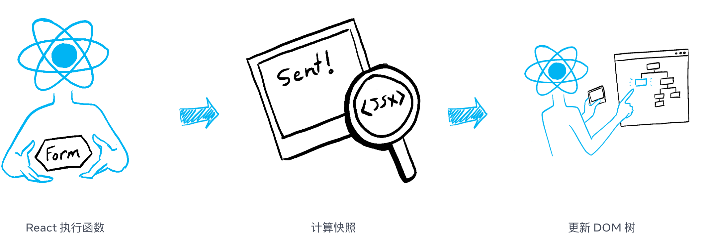
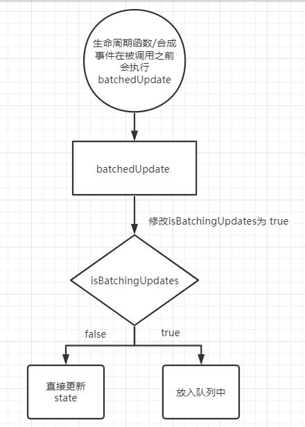

# setState 原理

React 理念， UI = f(data)，即修改 data 驱动 UI 变化，这里的 data 可以指代组件的 props 和组件内部的 state。

## legacy 模式的 setState

`setState()` 将对组件 state 的更改排入队列，并通知 React 需要使用更新后的 state 重新渲染此组件及其子组件。这是用于更新用户界面以响应事件处理器和处理服务器数据的主要方式。

将 `setState()` 视为请求而不是立即更新组件的命令。为了更好的感知性能，React 会延迟调用它，然后通过一次传递更新多个组件。在罕见的情况下，你需要强制 DOM 更新同步应用，你可以使用 flushSync 来包装它，但这可能会损害性能。

`setState()` 并不总是立即更新组件。它会批量推迟更新。这使得在调用 `setState()` 后立即读取 this.state 成为了隐患。为了消除隐患，请使用 componentDidUpdate 或者 setState 的回调函数（setState(updater, callback)），这两种方式都可以保证在应用更新后触发。如需基于之前的 state 来设置当前的 state，请阅读下述关于参数 updater 的内容。

除非 shouldComponentUpdate() 返回 false，否则 setState() 将始终执行重新渲染操作。如果可变对象被使用，且无法在 shouldComponentUpdate() 中实现条件渲染，那么仅在新旧状态不一时调用 setState()可以避免不必要的重新渲染。

参数一为带有形式参数的 updater 函数：

```js
(state, props) => stateChange;
```

state 是对应用变化时组件状态的引用。当然，它不应直接被修改。你应该使用基于 state 和 props 构建的新对象来表示变化。例如，假设我们想根据 props.step 来增加 state：

```js
this.setState((state, props) => {
  return { counter: state.counter + props.step };
});
```

updater 函数中接收的 state 和 props 都保证为最新。updater 的返回值会与 state 进行浅合并。

setState() 的第二个参数为可选的回调函数，它将在 setState 完成合并并重新渲染组件后执行。

## [state 如同一张快照](https://zh-hans.react.dev/learn/state-as-a-snapshot)



作为一个组件的记忆，state 不同于在你的函数返回之后就会消失的普通变量。state 实际上“活”在 React 本身中——就像被摆在一个架子上！——位于你的函数之外。当 React 调用你的组件时，它会为特定的那一次渲染提供一张 state 快照。你的组件会在其 JSX 中返回一张包含一整套新的 props 和事件处理函数的 UI 快照 ，其中所有的值都是 根据那一次渲染中 state 的值 被计算出来的！

## [对 state 更新进行批处理-把一系列 state 更新加入队列](https://zh-hans.react.dev/learn/queueing-a-series-of-state-updates)

React 会`批量处理状态更新`。它会在**所有事件处理函数运行**并调用其 set 函数后更新屏幕。这可以防止在单个事件期间多次重新渲染。在某些罕见情况下，你需要强制 React 更早地更新屏幕，例如访问 DOM，你可以使用 flushSync。

React 会等到事件处理函数中的 所有 代码都运行完毕再处理你的 state 更新。

这让你可以更新多个 state 变量——甚至来自多个组件的 state 变量——而不会触发太多的**重新渲染**。但这也意味着只有在你的事件处理函数及其中任何代码执行完成 之后，UI 才会更新。这种特性也就是**批处理**，它会使你的 React 应用运行得更快。它还会帮你避免处理只更新了一部分 state 变量的令人困惑的“半成品”渲染。

**React 不会跨多个 需要刻意触发的事件（如点击）进行批处理**——每次点击都是单独处理的。请放心，React 只会在一般来说安全的情况下才进行批处理。这可以确保，例如，如果第一次点击按钮会禁用表单，那么第二次点击就不会再次提交它。

队列更新模拟代码如下：

```js
export function getFinalState(baseState: any, queue: any[]) {
  let finalState = baseState;

  for (let update of queue) {
    if (typeof update === "function") {
      finalState = update(finalState);
    } else {
      finalState = update;
    }
  }

  return finalState;
}
```

## 更新 state 中的对象和数组

你应当视 React 中任意的 state 为 mutation 类型的值，即它们是不能被改变或者是只读的。当给对象设置 state 的时候，你应该创建（或者拷贝）一个新对象，将它传给 state 设置函数。

数组同理，你不应该修改 state 中的原数组，而是新创建一个数组，将它传给 state 设置函数，这样才能触发界面渲染。否则将无法正确触发 UI 渲染。

## setState 是同步的还是异步的？

### react 18 之前

setState 在不同的情况下可以表现为异步或者同步。
在 Promise 的状态更新、js 原生事件、setTimeout、setInterval...中是同步的。
在 react 合成事件中，是异步的。

**为什么这么处理？**

因为性能优化。假如每次 setState 都要更新数据，更新过程就要走五个生命周期，走完一轮生命周期再拿 render 函数的结果去做 diff 对比和更新真实 DOM，会很耗时间。所以将每次调用都放一起做一次性处理，能降低对 DOM 的操作，提高应用性能。

**异步的原因**

setState 的函数实现中，会根据 isBatchingUpdates（默认是 false）变量判断是否直接更新 this.state 还是放到队列中稍后更新。有一个 batchedUpdate 函数，可以修改 isBatchingUpdates 为 true，当 React 调用事件处理函数之前或者生命周期函数之前就会调用 batchedUpdate 函数为 false，这样的话，setState 就不会同步更新 this.state，而是放到更新队列里面后续更新。


**为什么会引起性能的消耗？**

先是每次调用 setState 都要重新触发一次生命周期钩子函数， render 之后形成新的虚拟 dom ，新旧虚拟 dom 做对比，diff 需要花费性能
然后把 diff 后的 patch 更新到真实 dom 上，也需要消耗性能

### react 18 之后

setState 都会表现为异步（即批处理），包括，concurrent rendering 模式。

## 面试代码题

### alert 弹出的警告是什么？

```js
import { useState } from "react";

export default function Counter() {
  const [number, setNumber] = useState(0);

  return (
    <>
      <h1>{number}</h1>
      <button
        onClick={() => {
          setNumber(number + 5);
          alert(number);
        }}
      >
        +5
      </button>
    </>
  );
}
```

**答案**

打印 0，state 快照，在事件交互的时候已经确定了 number 的值，一个 state 变量的值永远不会在一次渲染的内部发生变化。React 会使 state 的值始终“固定”在一次渲染的各个事件处理函数内部。你无需担心代码运行时 state 是否发生了变化。

### 点击 +3 打印什么？

```js
import { useState } from "react";

export default function Counter() {
  const [number, setNumber] = useState(0);

  return (
    <>
      <h1>{number}</h1>
      <button
        onClick={() => {
          setNumber(number + 1);
          setNumber(number + 1);
          setNumber(number + 1);
        }}
      >
        +3
      </button>
    </>
  );
}
```

**答案**

打印 1，因为 React 批处理将多次 setState 被 react 合并成一次

```js
<button
  onClick={() => {
    setNumber(0 + 1);
    setNumber(0 + 1);
    setNumber(0 + 1);
  }}
>
  +3
</button>
```

**如果想更新同一个 state 怎么办**

你可以像 setNumber(n => n + 1) 这样传入一个根据队列中的前一个 state 计算下一个 state 的 函数。

setState(x) 实际上会像 setState(n => x) 一样运行，它们之前唯一的区别是是否使用队列中的 n（记忆值）。

```js
import { useState } from "react";

export default function Counter() {
  const [number, setNumber] = useState(0);

  return (
    <>
      <h1>{number}</h1>
      <button
        onClick={() => {
          setNumber((n) => n + 1);
          setNumber((n) => n + 1);
          setNumber((n) => n + 1);
        }}
      >
        +3
      </button>
    </>
  );
}
```

### 代码修复挑战

完成官网中的挑战[链接](https://zh-hans.react.dev/learn/queueing-a-series-of-state-updates)：

1. 修复请求计数器

```js
import { useState } from "react";

export default function RequestTracker() {
  const [pending, setPending] = useState(0);
  const [completed, setCompleted] = useState(0);

  async function handleClick() {
    setPending(pending + 1);
    await delay(3000);
    setPending(pending - 1);
    setCompleted(completed + 1);
  }

  return (
    <>
      <h3>等待：{pending}</h3>
      <h3>完成：{completed}</h3>
      <button onClick={handleClick}>购买</button>
    </>
  );
}

function delay(ms) {
  return new Promise((resolve) => {
    setTimeout(resolve, ms);
  });
}
```

**答案** 修改 setState 方式为 updater 函数形式

2. 自己实现状态队列

## 参考文章

[React 官方 setState](https://zh-hans.legacy.reactjs.org/docs/react-component.html#setstate)

[useState hook](https://zh-hans.react.dev/reference/react/useState)

[The Two Reacts](https://overreacted.io/the-two-reacts/)

[把一系列 state 更新加入队列](https://zh-hans.react.dev/learn/queueing-a-series-of-state-updates)
