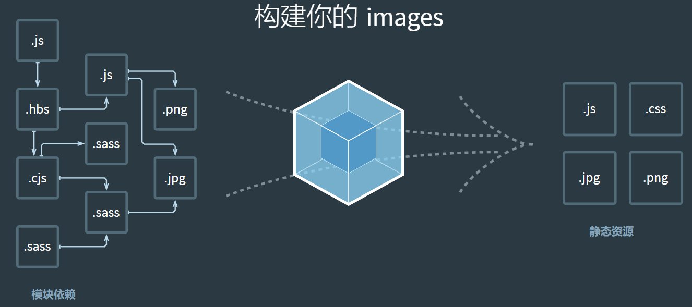
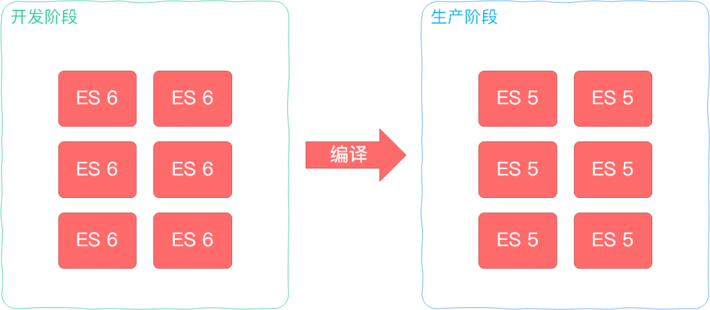
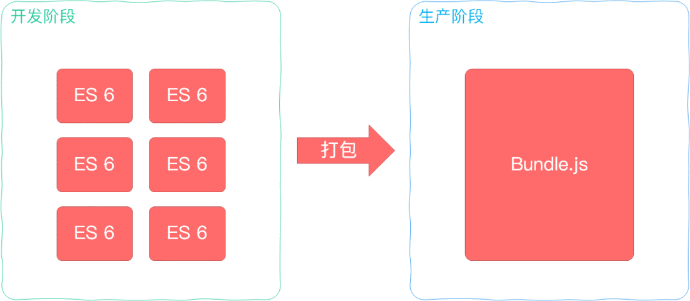
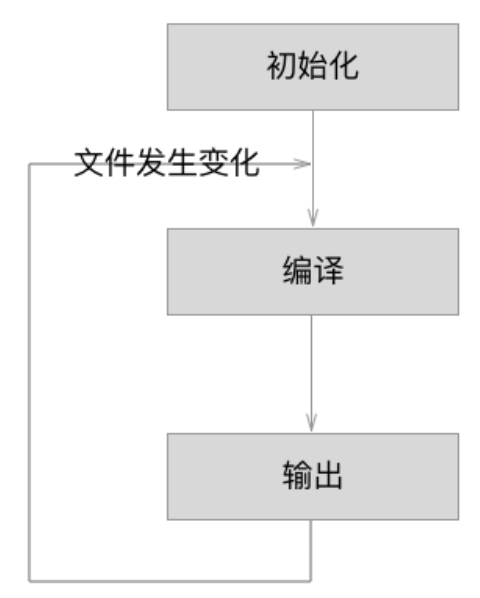

# Webpack 原理

## 背景

Webpack 最初的目标是实现前端项目的模块化，旨在更高效地管理和维护项目中的每一个资源

## 模块化

发展历程：

1. 文件是独立模块，通过 js 文件引入到页面，一个 script 标签对应一个模块

   - 弊端：模块都是在全局中工作，大量模块成员污染了环境，模块与模块之间并没有依赖关系、维护困难、没有私有空间等问题

2. 命名空间

```js
window.moduleA = {
  method1: function () {
    console.log("moduleA#method1");
  },
};
```

没有解决模块之间依赖关系问题

3. 使用立即函数为模块提供私有空间，通过参数的形式作为依赖声明

```js
// module-a.js
(function ($) {
  var name = "module-a";

  function method1() {
    console.log(name + "#method1");
    $("body").animate({ margin: "200px" });
  }

  window.moduleA = {
    method1: method1,
  };
})(jQuery);
```

同样没有解决模块依赖问题

## 模块化规范

CommonJS、ES Modules

## 开发过程中产生的问题

现代前端开发已经变得十分的复杂，所以我们开发过程中会遇到如下的问题：

- 需要通过模块化的方式来开发

- 使用一些高级的特性来加快我们的开发效率或者安全性，比如通过 ES6+、TypeScript 开发脚本逻辑，通过 sass、less 等方式来编写 css 样式代码

- 监听文件的变化来并且反映到浏览器上，提高开发的效率

- JavaScript 代码需要模块化，HTML 和 CSS 这些资源文件也会面临需要被模块化的问题

- 开发完成后我们还需要将代码进行压缩、合并以及其他相关的优化

## webpack 解决方案

webpack 是一个用于现代 JavaScript 应用程序的静态模块打包工具

- 静态模块

这里的静态模块指的是开发阶段，可以被 webpack 直接引用的资源（可以直接被获取打包进 bundle.js 的资源）

当 webpack 处理应用程序时，它会在内部构建一个依赖图，此依赖图对应映射到项目所需的每个模块（不再局限 js 文件），并生成一个或多个 bundle



webpack 能力

编译代码能力：提高效率，解决浏览器兼容问题



模块整合能力：提高性能，可维护性，解决浏览器频繁请求文件的问题



万物皆可模块：

项目维护性增强，支持不同种类的前端模块类型，统一的模块化方案，所有资源文件的加载都可以通过代码控制

## webpack 构建流程

### 1. 运行流程

webpack 的运行流程是一个串行的过程，它的工作流程就是将各个插件串联起来

在运行过程中会广播事件，插件只需要监听它所关心的事件，就能加入到这条 webpack 机制中，去改变 webpack 的运作，使得整个系统扩展性良好

从启动到结束会依次执行以下三大步骤：

- 初始化流程：从配置文件和 Shell 语句中读取与合并参数，并初始化需要使用的插件和配置插件等执行环境所需要的参数

- 编译构建流程：从 Entry 发出，针对每个 Module 串行调用对应的 Loader 去翻译文件内容，再找到该 Module 依赖的 Module，递归地进行编译处理

- 输出流程：对编译后的 Module 组合成 Chunk，把 Chunk 转换成文件，输出到文件系统



#### 初始化流程

从配置文件和 Shell 语句中读取与合并参数，得出最终的参数

配置文件默认下为 webpack.config.js，也或者通过命令的形式指定配置文件，主要作用是用于激活 webpack 的加载项和插件

webpack 将 webpack.config.js 中的各个配置项拷贝到 options 对象中，并加载用户配置的 plugins

完成上述步骤之后，则开始初始化 Compiler 编译对象，该对象掌控者 webpack 声明周期，不执行具体的任务，只是进行一些调度工作

Compiler 对象继承自 Tapable，初始化时定义了很多钩子函数

#### 编译构建流程

根据配置中的 entry 找出所有的入口文件

```js
module.exports = {
  entry: "./src/file.js",
};
```

## 说说你对 webpack 的理解？解决了什么问题？

解决了前端项目模块化的问题，编译代码可以解决浏览器兼容性问题，支持模块整合。资源加载也可以模块化。
