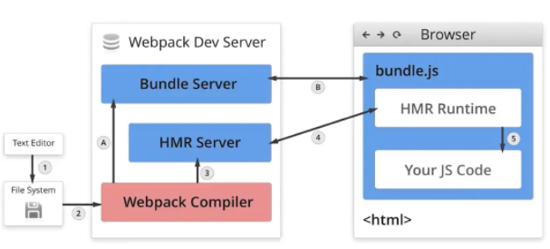
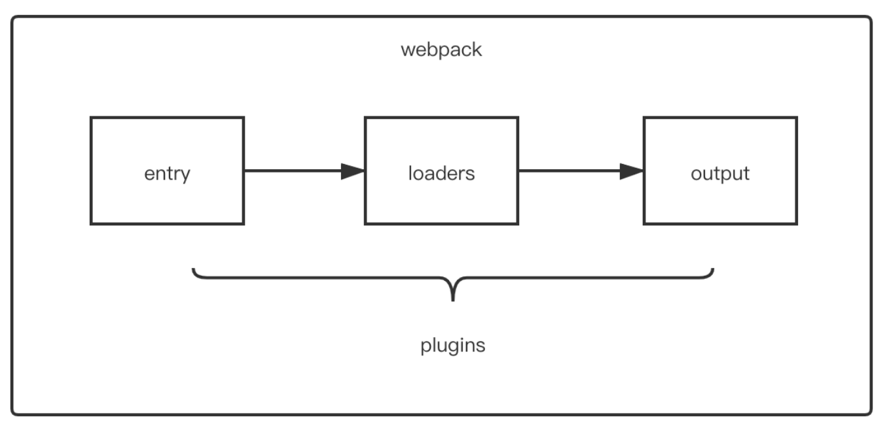

# Webpack 面试题

## 1. 说说你对 webpack 的了解，解决了什么问题？

### 了解：

最初的目的是实现前端的模块化，它的目标是更高效地管理和维护项目中的每一个资源（js、css、图片、字体、svg）。

Webpack 是一个用于现代 JavaScript 应用程序的静态模块打包工具。主要从根本上解决了 JS 模块化开发问题。它可以把不同类型的文件都视作一个模块，支持对不同模块进行解析、编译、翻译后整合成一个或者多个 bundle 产物。

### 解决的问题：

- 模块化：
  - 模块之间没有依赖关系，多个脚本之间成员变量污染全局环境，没有私有空间
  - Webpack 支持使用 ES Modules 模块化开发
- 提升开发效率：
  - 高级特性支持，例如可以 ES6 + Typescript 来开发脚本逻辑，使用 less 和 sass 编写 css 样式代码，webpack 可以帮我们把代码编译成低版本浏览器可兼容性代码
  - 自动监听和热加载，支持热模块替换，在开发过程中无需手动刷新页面，即可看到修后的效果
- 代码优化和压缩
  - 通过压缩文件，减少代码体积，提高加载速度
  - 支持合并、分割代码，将公共代码提取为单独的文件，充分利用浏览器的缓存机制
- 资源加载控制
  - Tree-shaking

### Webpack 能力：

1. 编译代码的能力：Webpack 可以编译各种类型的资源文件，如 JavaScript、CSS、图片等。它支持对 ES6+和 TypeScript 的编译，将高级语法转换为浏览器可识别的代码，解决了浏览器兼容性问题。

2. 模块整合的能力：Webpack 可以将项目中的所有模块整合为一个或多个 bundle。它会在内部构建一个依赖图，映射项目所需的每个模块，将它们整合在一起。这样可以减少浏览器频繁请求文件的问题，提高页面加载速度和性能。

3. 万物皆可模块的能力：Webpack 支持将所有资源文件都视为模块。不仅可以处理 JavaScript 模块，还可以处理 HTML、CSS、图片等资源模块。这样使得项目维护更加方便，统一了模块化方案，所有资源文件的加载都可以通过代码控制。

## 2. 说说 webpack 热更新是如何做到的？原理是什么？

### 概念：

HMR，hot module replacement。指在应用程序运行过程中，替换、添加、删除模块，而无需刷新整个应用。

### 原理：



- Webpack compile：将 JS 源码编译成 bundle
- HMR Server: 用来将热更新的文件输出给 HMR Runtime
- Bundle Server: 静态文件服务器，提供文件访问路径
- HMR Runtime: socket 服务器，会被注入到浏览器，更新文件的变化
- bundle.js：构建输出的文件
- 在 HMR Runtine 和 HMR Server 之间建立 websocket 连接，用于实时更新文件变化。
  步骤：

1. 轮询本地文件，通过文件 hash 判断文件是否发生变化
2. 触发 webpack compile 编译，将源代码和 HMR Runtime 一起编译生成 bundle.js
3. Bundle Server 静态文件服务器挂载 bundle.js 文件
4. 浏览器访问 bundle.js，运行 HMR Runtime 和 HMR Server 建立 websocket 连接
5. 系统维护 manifest 列表 ，文件 hash 和 chunkId 的映射
6. 文件发生变化，触发编译后，通过 socket 获取获取到变化的 manifest 中的文件 hash，触发 render，实现局部模块更新

## 3. 说说 webpack 构建流程？

Webpack 运行流程是一个串行的过程，它的工作流程就是将各个插件串联起来。

1. 初始化参数，获取用户在 webpack.config.js 文件配置的参数
2. 开始编译，初始化 compile 对象，注册所有插件，插件开始监听 webpack 构建过程的生命周期事件，不同的环节会有不同的处理，然后开始执行编译
3. 确定入口，根据配置中的 entry 确定文件入口，开始从入口解析文件构建 ast 语法树，找到依赖，递归下期。
4. 编译模块。递归过程中，根据文件类型和 loader 配置，调用相应的 loader 对不同的文件做转换处理。再找出该模块依赖的模块，进行递归操作，直到项目中依赖的所有模块都经过了编译处理
5. 完成编译并输出，根据 output 配置生成代码块 chunk，输出到对应路径

## 4. 说说 webpack 中常见的 Loader？解决了什么问题？

在 Webpack 中，Loader 是用于处理各种文件类型的模块加载器，它们用于对文件进行转换、处理和加载。
常见 loaders：

- css-loader，支持 css 文件的加载和解析
- less-loader，sass-loader，将 less、sass 转换成 css 文件
- ts-loader，将 ts 文件转换成 js
- raw-loader，将文件以字符串形式导入
- file-loader，分发文件到 output 目录并返回相对路径
- url-loader，和 file-loader 类似，但是当文件小于设定的 limit 时可以返回一个 Data Url
- babel-loader，高级 JS 语法语法转换

## 5. 说说 webpack 中常见的 Plugin？解决了什么问题？

webpack 中的 plugin 也是如此，plugin 赋予其各种灵活的功能，例如打包优化、资源管理、环境变量注入等，它们会运行在 webpack 的不同阶段（钩子 / 生命周期），贯穿了 webpack 整个编译周期，目的在于解决 loader 无法实现的其他事。

常见插件：

- html-webpack-plugin:在打包结束后，生成或者引入 html 模版文件，把打包生成的 bundle.js 引入到 html 中
- clean-webpack-plugin: 删除构建目录
- min-css-extact-plugin: 提取 css 到一个单独的文件中去
- HMR：热更新插件

## 6. 说说 Loader 和 Plugin 的区别？编写 Loader，Plugin 的思路？

- loader 是文件加载器，能够加载资源文件，并对这些文件进行一些处理，诸如编译、压缩等，最终一起打包到指定的文件中
- plugin 赋予了 webpack 各种灵活的功能，例如打包优化、资源管理、环境变量注入等，目的是解决 loader 无法实现的其他事



可以看到，两者在运行时机上的区别：

- loader 运行在打包文件之前
- plugins 在整个编译周期都起作用

在 Webpack 运行的生命周期中会广播出许多事件，Plugin 可以监听这些事件，在合适的时机通过 Webpack 提供的 API 改变输出结果
对于 loader，实质是一个转换器，将 A 文件进行编译形成 B 文件，操作的是文件，比如将 A.scss 或 A.less 转变为 B.css，单纯的文件转换过程

### 6.1 编写 loader

在编写 loader 前，我们首先需要了解 loader 的本质

其本质为函数，函数中的 this 作为上下文会被 webpack 填充，因此我们不能将 loader 设为一个箭头函数

函数接受一个参数，为 webpack 传递给 loader 的文件源内容

函数中 this 是由 webpack 提供的对象，能够获取当前 loader 所需要的各种信息

函数中有异步操作或同步操作，异步操作通过 this.callback 返回，返回值要求为 string 或者 Buffer

代码如下所示：

```js
// 导出一个函数，source为webpack传递给loader的文件源内容
module.exports = function (source) {
  const content = doSomeThing2JsString(source);

  // 如果 loader 配置了 options 对象，那么this.query将指向 options
  const options = this.query;

  // 可以用作解析其他模块路径的上下文
  console.log("this.context");

  /*
   * this.callback 参数：
   * error：Error | null，当 loader 出错时向外抛出一个 error
   * content：String | Buffer，经过 loader 编译后需要导出的内容
   * sourceMap：为方便调试生成的编译后内容的 source map
   * ast：本次编译生成的 AST 静态语法树，之后执行的 loader 可以直接使用这个 AST，进而省去重复生成 AST 的过程
   */
  this.callback(null, content); // 异步
  return content; // 同步
};
```

一般在编写 loader 的过程中，保持功能单一，避免做多种功能

如 less 文件转换成 css 文件也不是一步到位，而是 less-loader、css-loader、style-loader 几个 loader 的链式调用才能完成转换

### 6.2 编写 plugin

由于 webpack 基于发布订阅模式，在运行的生命周期中会广播出许多事件，插件通过监听这些事件，就可以在特定的阶段执行自己的插件任务

在之前也了解过，webpack 编译会创建两个核心对象：

- compiler：包含了 webpack 环境的所有的配置信息，包括 options，loader 和 plugin，和 webpack 整个生命周期相关的钩子
- compilation：作为 plugin 内置事件回调函数的参数，包含了当前的模块资源、编译生成资源、变化的文件以及被跟踪依赖的状态信息。当检测到一个文件变化，一次新的 Compilation 将被创建

如果自己要实现 plugin，也需要遵循一定的规范：

- 插件必须是一个函数或者是一个包含 apply 方法的对象，这样才能访问 compiler 实例
- 传给每个插件的 compiler 和 compilation 对象都是同一个引用，因此不建议修改
- 异步的事件需要在插件处理完任务时调用回调函数通知 Webpack 进入下一个流程，不然会卡住

实现 plugin 的模板如下：

```js
class MyPlugin {
  // Webpack 会调用 MyPlugin 实例的 apply 方法给插件实例传入 compiler 对象
  apply(compiler) {
    // 找到合适的事件钩子，实现自己的插件功能
    compiler.hooks.emit.tap("MyPlugin", (compilation) => {
      // compilation: 当前打包构建流程的上下文
      console.log(compilation);

      // do something...
    });
  }
}
```

在 emit 事件发生时，代表源文件的转换和组装已经完成，可以读取到最终将输出的资源、代码块、模块及其依赖，并且可以修改输出资源的内容

## 7. 说说如何借助 webpack 来优化前端性能？

1. 代码压缩

- JS
- CSS
- HTML

2. 图片压缩

3. TreeShaking

4. 公共模块代码抽离

5. 内联 chunk

## 8. 如何提高 webpack 的构建速度？
