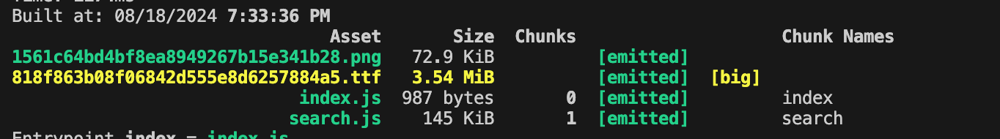
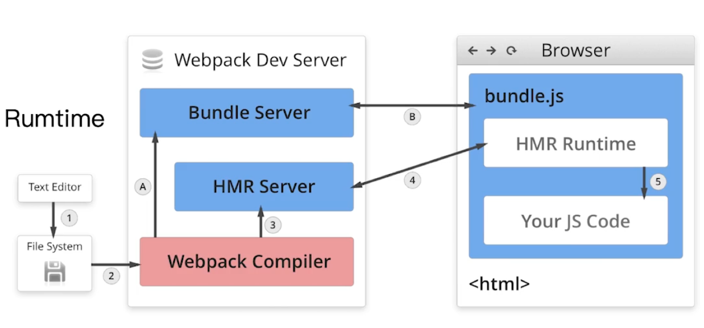
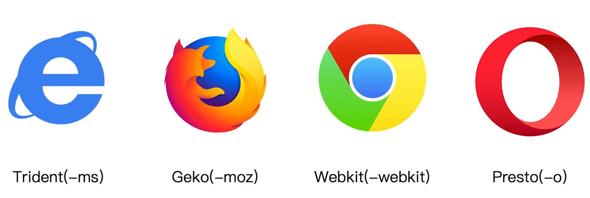

# 玩转 webpack

1. 基础篇：webpack 的基本概念和日常开发的实用技巧

2. 进阶篇：以工程化的方式组织 webpack 构建配置，和 webpack 打包优化

3. 原理篇：详细剖析 webpack 打包原理和插件、Loader 的实现

4. 实战篇：从实际 Web 商城项目出发，讲解 webpack 实际应用

## 基础篇

### 1. webpack 与构建发展历史

为什么需要构建工具：

- 转换 ES6 语法
- 转换 JSX
- CSS 前缀补全/预处理器（less，sass）
- 压缩混淆
- 图片压缩

前端构建演变之路：

- ant + YUI Tool -> grunt（磁盘） -> fis3 gulp（内存） -> rollup、webpack、parcel

为什么选择 webpack

- 社区生态丰富

- 配置灵活和插件化扩展（loader、插件）

- 官方更新迭代速度快

### 2. webpack 基础用法

#### 初始 webpack：配置文件名称

webpack 默认配置文件：webpack.config.js

可以通过 webpack --config 指定配置文件

webpack 配置组成部分

```js
module.exports = {
  entry: "./src/index,js", // 打包入口配置
  output: "./dist/main.js", // 打包的输出
  mode: "production", // 环境
  // loader 配置
  module: {
    rules: [{ test: /\.txt$/, use: "raw-loader" }],
  },
  // 插件配置
  plugins: [
    new HtmlwebpackPlugin({
      template: "./src/index.html",
    }),
  ],
};
```

#### 安装 webpack

```shell
npm install webpack@4 webpack-cli@4 --save-dev
```

#### webpack 初体验：一个最简单的例子

1. 配置 webpack.config.js

```js
"use strict";

const path = require("path");

module.exports = {
  entry: "./src/index.js",
  output: {
    path: path.join(__dirname, "dist"),
    filename: "bundle.js",
  },
  mode: "production",
};
```

2. 编写 index.js

```js
// helloworld.js
export function helloworld() {
  return "Hello webpack";
}

// index.js
import { helloworld } from "./helloworld";

document.write(helloworld());
```

3. 查看输出的 dist/bundle.js 文件

#### 通过 npm script 运行 webpack

在 package.json 中增加 build 命令

```json
"scripts": {
  "build": "webpack",
  "test": "echo \"Error: no test specified\" && exit 1"
}
```

#### webpack 核心概念之 entry 用法

entry 用来指定 webpack 的打包入口（模块打包器），开始遍历文件

对于非代码比如图片、字体依赖也会不断地加入依赖图

依赖图的入口是 entry

单入口：

- entry 是一个字符窜

```js
module.exports = {
  entry: "./src/index.js",
};
```

多入口：

- entry 是一个对象

```js
module.exports = {
  entry: {
    app: "./src/app.js",
    adminApp: "./src/adminApp.js",
  },
};
```

#### output 用法

ouput 用来告诉 webpack 如何将编译后的文件输出到磁盘

多入口配置

```js
module.exports = {
  entry: {
    app: "./src/app.js",
    adminApp: "./src/adminApp.js",
  },
  output: {
    filename: "[name].js",
    path: __dirname + "/dist",
  },
};
```

#### loaders

webpack 开箱即支持 JS 和 JSON 两种文件类型，通过 loaders 去支持其他文件类型并且把它们转换成有效的模块，并且可以添加到依赖图中。

本身是一个函数，接受源文件作为参数，返回转换的结果。

常见的 loaders

- babel-loader 转换 es6、es7 等 js 新特性语法
- css-loader 支持 .css 文件的加载和解析
- less-loader 将 less 文件转换成 css
- ts-loader 将 ts 转换成 css
- file-loader 进行图片、字体等的打包
- raw-loader 将文件以字符串形式导入
- thread-loader 多进程打包 js 和 css

loaders 的用法

```js
module: {
  rules: [
    // test 指定匹配规则，use 指定使用的 loader 名称
    { test: /\.txt$/, use: "raw-loader" },
  ];
}
```

#### plugins

插件用于 bundle 文件的优化，资源管理和环境变量注入

作用域整个构建过程（从 webpack 开始构建到结束构建都可以作用）

常见的 plugins

- commonsChunkPlugin 讲 chunks 相同的模块代码提取成公共 js
- cleanWebpackPlugin 清理构建目录
- extractTextWebpackPlugin 将 css 从 bundle 文件里提取成一个独立的 css 文件
- copywebpackplugin 将文件或者文件夹拷贝到构建的输出目录
- htmlwebpackplugin 创建 html 文件去承载输出的 bundle
- uglifyjswebpackplugin 压缩 js
- zipwebpackplugin 将打包出的资源生成一个 zip 包

plugins 的用法

```js
// 放到 plugins 数组
plugins: [new HtmlWebpackPlugin({ template: "./src/index.html" })];
```

#### webpack 核心概念 mode

mode 用来指定当前的构建环境：production、development 还是 none

设置 mode 可以使用 webpack 内置的函数，默认值为 production

- development: process.env.NODE_ENV 为 development 开启 NamedChunksPlugin 和 NameModulesPlugin
- production: process.env.NODE_ENV 为 production，开启 TerserPlugin， SideEffectsFlagPlugin、FlagDependencyUsagePlugin，FlagIncludedChunksPlugin、ModuleConcatenationPlugin、NoEmitOnErrorsPlugin
- none：不开启任何优化

### 3. webpack 进阶用法

#### 解析 ES6 和 React JSX

使用 babel-loader

```js
module: {
  rules: [{ test: /\.js$/, use: "babel-loader" }];
}
```

babel 的配置文件是： .babelrc

增加 es6 的 babel preset 配置

```js
{
  // 预设的意思
  "presets": [
    "@babel/preset-env"
  ],
  "plugins": [
    "@babel/proposal-class-properties"
  ]
}
```

安装依赖，—D,--save-dependencies

```shell
npm i @babel/preset-env babel-loader @babel/core -D
```

webpack.config.js

```js
module.exports = {
  entry: {
    index: "./src/index.js",
    search: "./src/search.js",
  },
  output: {
    path: path.join(__dirname, "dist"),
    filename: "[name].js",
  },
  mode: "production",
  module: {
    rules: [{ test: /.js$/, use: "babel-loader" }],
  },
};
```

增加 react 的 babel preset 配置

```shell
npm i @babel/preset-react -D
```

```js
{
  "presets": ["@babel/preset-env", "@babel/preset-react"]
}
```

即可解析 es6 和 react 语法

#### 解析 css、less 和 sass

css-loader 用于加载 .css 文件，并且转换成 commonjs 对象

style-loader 将样式通过 `<style>` 标签插入到 header 中

配置 webpack，loader 是链式调用，从右到左，先 css-loader 解析，然后传给 style-loader

```js
module.exports = {
  module: {
    rules: [
      { test: /.js$/, use: "babel-loader" },
      // 增加 css 解析
      { test: /.css$/, use: ["style-loader", "css-loader"] },
    ],
  },
};
```

#### 解析 less 和 sass

less-loader 用于将 less 转换成 css

安装依赖 `npm i less css-loader style-loader less-loader -D`, less-loader 依赖 less 所以需要一起安装。

```js
module.exports = {
  module: {
    rules: [
      { test: /.js$/, use: "babel-loader" },
      { test: /.css$/, use: ["style-loader", "css-loader"] },
      // 配置 less loader
      { test: /.less$/, use: ["style-loader", "css-loader", "less-loader"] },
    ],
  },
};
```

#### 解析字体和图片

file-loader 用于处理文件

安装 filer-loader ` npm i file-loader -D`

```js
module.exports = {
  module: {
    rules: [
      // ...
      // file loader 配置
      { test: /.(png|jpg|gif|jpeg)$/, use: "file-loader" },
    ],
  },
};
```

file-loader 用于处理字体

```js
module.exports = {
  module: {
    rules: [
      // 处理字体
      { test: /.(woff|ttf|woff2|eot|otf)$/, use: "file-loader" },
    ],
  },
};
```

url-loader 也可以处理字体和图片，可以设置较小资源自动 base64 编码


```js
module.exports = {
  module: {
    rules: [
      {
        test: /.(png|jpg|gif|jpeg)$/,
        use: [
          {
            loader: "url-loader",
            options: {
              // 设置小于 10kb 的图片编译成 base64
              limit: 10240,
            },
          },
        ],
      },
    ],
  },
};
```

在控制台查看模块大小和信息：



#### webpack 文件监听

文件监听是在发现源码发生变化时，自动重新构建出新的输出文件

webpack 开启监听模式，有两种方式：

- 在启动 webpack 命令时候，带上 `--watch` 参数

- 在配置 webpack.config.js 中设置 `watch:true`

```js
"scripts": {
  "build": "webpack",
  "watch": "webpack --watch",
  "test": "echo \"Error: no test specified\" && exit 1"
},
```

文件监听原理分析

轮询判断文件的最后编辑时间是否变化

某个文件发生了变化，并不会立刻告诉监听者，而是先缓存起来，等 arrgegateTimeout

```js
module.export = {
  // 默认 false 也就是不开启监听
  watch: true,

  // 只有开启监听模式，watchOptions 才有意义
  watchOptions: {
    // 默认为空，不监听的文件或者文件夹，支持正则匹配
    ignored: /node_modules/,
    // 监听到变化发生后会等待300ms再去执行，默认300ms
    aggregateTimeout: 300,
    // 判断文件是否发生变化是通过不停询问系统指定文件有没有变化实现的，默认每秒问1000次，1ms 询问一次
    poll: 1000,
  },
};
```

#### webpack 中的热更新以及原理分析

热更新： webpack-dev-server

WDS 不刷新浏览器

WDS 不输出文件，而是放在内存中

使用 HotModuleReplacementPlugin 插件，配置 devServer static 选项设置监控路径

```js
module.exports = {
  mode: "development",
  plugins: [new webpack.HotModuleReplacementPlugin()],
  devServer: {
    hot: true,
    port: 9000,
    static: "./dist",
  },
};
```

热更新：使用 webpack-dev-middleware

WDM 将 webpack 输出的文件传给服务器，适用于灵活的定制场景

热更新的原理分析：

- webpack compile: 将 JS 编译成 Bundle

- HMR Server：将热更新的文件传输给 HMR Runtime

- Bundle Server：提供文件在浏览器的访问（服务器）

- HMR Runtime: 会被注入到浏览器更新文件的变化 （注入到 bundle.js，服务器通信 websocket，更新文件变化）

- bundle.js： 构建输出的文件



#### 文件指纹策略

打包后输出的文件名的后缀，例如`index_51727db.js`

- hash: 和整个项目的构建有关，只要项目文件有修改，整个项目构建的 hash 值就会更改

- chunkhash: 和 webpack 打包的 chunk 有关，不同的 entry 会生成不同的 chunkhash 值

- contenthash: 根据文件内容来定义 hash，文件内容不变，则 contenthash 不变

JS 的文件指纹设置

- 设置 output 的 filename， 使用 [chunkhash]

```js
output: {
  filename: '[name][chunkhash:8].js',
}
```

CSS 的文件指纹设置

- 先需要使用 mini-css-extract-plugin 插件来提取 css 文件，和 style-loader 功能冲突，需要删除 style-loader

  - style-loader 是把 css 放入 header，而 mini-css-extract-plugin 是把 css 提取成文件

- 使用 contenthash

- 配置如下

```js
const MiniCssExtractPlugin = require("mini-css-extract-plugin");

module.exports = {
  module: {
    rules: [
      { test: /.css$/, use: [MiniCssExtractPlugin.loader, "css-loader"] },
      {
        test: /.less$/,
        use: [MiniCssExtractPlugin.loader, "css-loader", "less-loader"],
      },
    ],
  },
  plugins: [
    new MiniCssExtractPlugin({
      filename: "[name]_[contenthash:8].css",
    }),
  ],
};
```

图片字体的指纹设置

- 设置 file-loader 的 name 使用 [hash]

```js
 {
    test: /.(png|jpg|gif|jpeg)$/,
    use: [
      {
        loader: "url-loader",
        options: {
          limit: 10240,
          // 32位取前8
          name: "img/[name][hash:8].[ext]"
        },
      },
    ],
  },
```

#### HTML、CSS 和 JS 代码压缩

字节数更小，体积更小：

- HTML 压缩

  - html-webpack-plugin， 设置压缩参数

- CSS 文件的压缩

  - css-minimizer-webpack-plugin（压缩 css 插件） + MiniCssExtractPlugin (提取 css 文件)

- JS 压缩

  - 内置 uglifyjs-webpack-plugin，无需额外处理

html 压缩

```js
const HtmlWebpackPlugin = require("html-webpack-plugin");

module.exports = {
  plugins: [
    new MiniCssExtractPlugin({
      filename: "[name]_[contenthash:8].css",
    }),
    new HtmlWebpackPlugin({
      template: path.join(__dirname, "src/search.html"),
      filename: "search.html",
      chunks: ["search"],
      inject: true,
      minify: {
        html5: true,
        collapseWhitespace: true,
        preserveLineBreaks: false,
        minifyCSS: true,
        minifyJS: true,
        removeComments: false,
      },
    }),
    new HtmlWebpackPlugin({
      template: path.join(__dirname, "src/index.html"),
      filename: "index.html",
      chunks: ["index"],
      inject: true,
      minify: {
        html5: true,
        collapseWhitespace: true,
        preserveLineBreaks: false,
        minifyCSS: true,
        minifyJS: true,
        removeComments: false,
      },
    }),
  ],
};
```

css 压缩

```js
const MiniCssExtractPlugin = require("mini-css-extract-plugin");
const CssMinimizerPlugin = require("css-minimizer-webpack-plugin");

module.exports = {
  optimization: {
    minimizer: [new CssMinimizerPlugin()],
  },
  plugins: [
    new MiniCssExtractPlugin({
      filename: "[name]_[contenthash:8].css",
    }),
  ],
};
```

#### 自动清理构建目录产物

使用 `clean-webpack-plugin` 来清理输出目录

安装命令： `npm i clean-webpack-plugin -D`

```js
// 引入插件
const { CleanWebpackPlugin } = require("clean-webpack-plugin");

// 在 plungins 处配置
plugins: [new webpack.HotModuleReplacementPlugin(), new CleanWebpackPlugin()];
```

#### PostCSS 插件自动补齐 CSS3 前缀

CSS3 的属性为什么需要前缀？



例如：

```css
.box {
  -moz-border-radius: 10px;
  -webkit-border-radius: 10px;
  -o-border-radius: 10px;
  border-radius: 10px;
}
```

根据 Can I Use 规则，使用 postcss、postcss-preset-env 自动补齐 CSS3 前缀。

终端安装依赖命令：

`npm install postcss-loader postcss postcss-preset-env --save-dev -D`

配置如下：

```js
  module: {
    rules: [
      {
        test: /.less$/,
        use: [
          MiniCssExtractPlugin.loader,
          "css-loader",
          {
            loader: "postcss-loader",
            options: {
              postcssOptions: {
                plugins: ["postcss-preset-env"],
              },
            },
          },
          "less-loader",
        ],
      },
    ],
  },
```

注意，还需要在 package.json 中增加下述配置才能生效：

表示支持 > 1% 的浏览器，兼容最新的两个浏览器版本

```json
  "browserslist": [
    "> 1%",
    "last 2 versions"
  ]
```

此时重新执行 `npm run build`，可以看到 dist 目录中的 flex 属性有自动补齐的前缀:

```css
.search-text {
  color: red;
  display: -webkit-box;
  display: -ms-flexbox;
  display: flex;
  font-size: 20px;
}
```

## 进阶篇

### 1. 编写可维护的 webpack 构建配置

### 2. webpack 构建速度和体积优化策略

## 原理篇

### 1. 通过源码掌握 webpack 打包原理

### 2. 编写 loader 和插件

## 实战篇

### React 全家桶和 webpack 开发商城的项目

## 参考文档

https://juejin.cn/post/7135369506070724638
